# Small Mercies

**Microinteractions, Perspective, and the Frontend Craft of Making People Feel Good**

*Mark Basford*

---

## Table of Contents

1. [About Time and the Practice of Noticing](#about-time-and-the-practice-of-noticing)
2. [The Small Stuff Is the Product](#the-small-stuff-is-the-product)
3. [Hello Again: Designing the Welcome Back Moment](#hello-again-designing-the-welcome-back-moment)
4. [First Impressions in Milliseconds](#first-impressions-in-milliseconds)
5. [Motion with Manners](#motion-with-manners)
6. [Language That Respects People](#language-that-respects-people)
7. [Gamification, Wins, and Why Small Success Matters](#gamification-wins-and-why-small-success-matters)
8. [The Other Side of Craft](#the-other-side-of-craft)
9. [Waiting, Loading, and Anxiety](#waiting-loading-and-anxiety)
10. [Designing for Mistakes and Bad Days](#designing-for-mistakes-and-bad-days)
11. [The Invisible User](#the-invisible-user)
12. [Systematizing Tiny Kindnesses](#systematizing-tiny-kindnesses)
13. [The Present-Tense Interface](#the-present-tense-interface)

---

# About Time and the Practice of Noticing

If you've seen a Richard Curtis film, you know the shape. Warm, messy, English, slightly too long, full of people being awkward about their feelings. He made *Four Weddings and a Funeral*, *Notting Hill*, and *Love Actually* — films that half the country has watched at Christmas at least once, whether they'd admit it or not. He writes about ordinary people navigating love and embarrassment and the weather, and he does it with enough charm that you forgive the bits that don't quite hold together.

In 2013, he made *About Time*. It's one of my favourite films. My wife's too — it's become one of those films we come back to, not because we've forgotten how it ends but because of how it makes us feel on the way there. If you haven't seen it, I'd genuinely recommend it before you read much further. Not because this chapter will spoil it — though it will — but because it's better experienced than summarised.

*About Time* is, on the surface, a romantic comedy about a man who can travel back in time. Tim, played by Domhnall Gleeson, discovers this ability on his twenty-first birthday when his father — played by Bill Nighy with exactly the right amount of gentle eccentricity — takes him into a cupboard and explains the family secret. The men in the family can revisit any moment they've already lived.

Tim does what anyone would do. He goes back and fixes things. An awkward first meeting with the woman he likes. A joke that landed badly. A New Year's Eve party where he was too shy to talk to anyone. He uses time travel as an undo button for social embarrassment, and for a while, it works.

But the film isn't really about fixing things. The fixing is the setup. The real story is about what happens when Tim stops.

## The Three Stages of Time Travel

Tim's relationship with time travel moves through three distinct phases, and each one maps — uncomfortably well — onto how most people approach craft.

**Stage one: correction.** Go back and fix the mistakes. Redo the conversation. Undo the cringe moment. This is the instinct. Something went wrong, so you rewind and try again until it goes right. The focus is entirely on removing the bad.

**Stage two: appreciation.** Tim's father, who is dying, gives him a piece of advice. Live each day twice. The first time, live it normally — with all the tensions, frustrations, and small annoyances that come with being alive. The second time, live it again, but notice how sweet the world can be.

Curtis shows this with three small scenes, and they're worth paying attention to because none of them are dramatic.

Tim wins a court case. The first time, he's serious, professional — he nods, gathers his papers, moves on. It's a good result, but he's already thinking about the next thing. The second time, he turns to the defendant and they celebrate together, quietly but genuinely. The same outcome. The only difference is that Tim is actually present for it.

Then ordering food. The first time, Tim is head down, rushing, trying to get through the transaction as quickly as possible. The second time, he has a polite exchange with the woman behind the counter. Looks at her. Smiles. The same thirty seconds, but inhabited differently.

Then running through the courts of central London — the kind of architecture that anyone who works there stops seeing after the first week. The first time, Tim rushes through. The second time, he stops. Looks up. Takes it in.

None of these are big moments. That's the point. They're a court verdict, a food order, and a corridor. They're the ordinary texture of a working day, and the only difference between the first and second pass is attention.

**Stage three: presence.** Tim takes it one step further than his father.

> "And in the end I think I've learned the final lesson from my travels in time; and I've even gone one step further than my father did: The truth is I now don't travel back at all, not even for the day, I just try to live every day as if I've deliberately come back to this one day, to enjoy it, as if it was the full final day of my extraordinary, ordinary life." [1]

He stops going back entirely. He decides to live each day only once, but to live it as if he had deliberately chosen to return to it.

Curtis shows what this looks like, and again, it's not dramatic. Tim gets up early with the children when both he and Mary are obviously exhausted, because he wants to — because getting up with your kids is a privilege even when it doesn't feel like one. He drops his daughter off at school and she disappears through the door, but then she comes back out to wave at him. He waves back. She goes in again, comes back out, waves again. A third time. He's still there. He gets to see all three waves because he didn't rush off after the first one.

The final montage extends this into the world. A nurse dancing in front of her colleagues. Tim's friend Harry throwing a bottle over his head, landing it in the bin, and celebrating like he's scored a goal. These aren't Tim's moments — they're other people's small mercies, and the camera catches them because someone is paying attention.

That last phrase from the monologue — "my extraordinary, ordinary life" — is the whole film in five words. The extraordinary isn't somewhere else. It's here, in the ordinary, if you learn to see it.

## The Psychology of Noticing

This isn't just a nice idea from a romantic comedy. There's a body of research behind it — and it starts with something you've almost certainly experienced.

You go on holiday. The first morning, you notice everything — the light, the sounds, the smell of the coffee, the colour of the shutters. By day five, you're walking the same streets and seeing none of it. The place hasn't changed. Your attention has. It moved on, the way attention does, and the things that were extraordinary on Monday became furniture by Friday.

Fred Bryant, a psychologist at Loyola University Chicago, has spent over four decades studying why this happens and what can be done about it. He calls the counter-mechanism *savouring* — the cognitive and behavioural processes through which people attend to, appreciate, and enhance positive experience. He and his colleague Joseph Veroff began this work in the early 1980s, and what they found puts a name to that holiday feeling.

Savouring is the deliberate regulation of positive emotional experience. It's not the same as being happy. Happiness is a state; savouring is a practice. You can be surrounded by good things and fail to savour any of them, which is exactly what most people do most of the time. [2]

Bryant and Veroff identified ten distinct savouring strategies that people use to extend and deepen positive experience. Some are intuitive — sharing with others, counting blessings. Others are more specific: *sensory-perceptual sharpening*, which means deliberately focusing attention on a particular sensory detail. The warmth of a cup in your hand. The exact shade of light through a window. The sound of rain on a roof.

This is what Tim does in his second pass through the day. He's not doing anything different. He's sharpening his attention on what's already there — the look on the defendant's face, the woman behind the counter, the ceiling of the court. [3]

The reason this matters — the reason savouring is a research field and not just a platitude — is hedonic adaptation. The hedonic treadmill, first described by Brickman and Campbell in 1971, is the observation that people tend to return to a baseline level of happiness after positive or negative events. Win the lottery, and within a year or two, you're roughly as happy as you were before. This was revised by Diener, Lucas, and Scollon in 2006 — adaptation isn't as complete or inevitable as Brickman originally proposed — but the general pattern holds. Good things stop feeling good because you get used to them. [4]

Savouring is one of the mechanisms that slows this down. By deliberately attending to positive experience — really noticing it, rather than letting it wash past — you extend its emotional impact. The experience lasts longer in memory. The positive feeling persists. Bryant's research suggests this isn't a personality trait. It's a skill, and it can be practised. [5]

Tim's daughter waving three times is savouring in action. The first wave is the event. The second and third waves only exist because Tim stayed — because he chose to remain in the moment rather than moving on to the next thing. The event didn't change. His attention did.

## The Dog Walk

I walk the dog every morning. It's the same route, more or less. Down the street, through the park, along the canal, back. Nothing happens. A lot happens.

There's a man I see most mornings who has a lurcher. We don't know each other's names. We know each other's dogs' names. We say good morning. Sometimes we comment on the weather. Sometimes we don't say anything at all, just nod. It takes about three seconds.

Those three seconds change the morning. Not dramatically. Not in any way I could quantify. But there's a texture to a morning where someone acknowledges you — where a stranger treats you like a regular part of the landscape, someone worth nodding to — that's different from a morning where you walk the same route in silence and nobody registers you at all.

This is what small mercies are. They're not grand gestures. They're not life-changing events. They're the tiny, almost-invisible moments of recognition, care, and attention that change how a day feels. A hello. A held door. A driver who waves you across. A barista who remembers your order. None of these things matter, objectively. All of them matter, experientially.

The question this book asks is: what if interfaces worked the same way?

## Correction, Then Attention

Most product teams start where Tim starts. Something is broken, so you fix it. A bug, a usability issue, a performance bottleneck. The work is reactive: identify problems, go back, make them better. This is necessary work. Nobody builds a good product without it.

But most teams also stay in this stage far longer than they should. The entire workflow becomes about correction — fixing what's wrong, closing tickets, resolving complaints. The roadmap is a list of things to stop being bad at. And if you spend all your time fixing, you never get to the second question, which is: what would it feel like if this were actually good?

There's a difference between a product that has no bugs and a product that feels good to use. The first is an absence — the removal of negatives. The second is a presence — the addition of something worth noticing.

Think about the last time you used a piece of software and felt something positive. Not satisfied — *felt something*. A moment of delight, or comfort, or recognition. The chances are it wasn't a feature. It was a detail. A loading animation that made you smile. An error message that felt like it was written by a human being. A return screen that remembered where you left off. A transition that made spatial sense.

These are microinteractions — tiny, self-contained moments within a product that do one thing — and they are the subject of this book. Not because they are technically complex (some are, most aren't), but because they are the mechanism by which a product communicates that someone cared.

## Designing as if You Chose to Return

Here's the lens I want to propose for the rest of this book, borrowed directly from Tim's final lesson.

What if you designed every interaction as if you had deliberately come back to it? As if this screen — this form, this loading state, this error message, this tooltip — was the one moment you chose to return to, to get right, to make worth noticing?

This is obviously impractical taken literally. Nobody has time to hand-craft every pixel of every state of every component. But as a mindset — as a question to hold in the back of your mind while you work — it changes what you pay attention to. It shifts the focus from "does this work?" to "how does this feel?" From "is there a bug?" to "is there a moment of care?"

Fred Bryant's research tells us that savouring is a skill. That noticing positive experience — and creating the conditions for it — can be practised and improved. The implication for interface design is direct: if people experience products as a sequence of moments, and if the quality of those moments depends on whether someone paid attention to them, then paying attention is the craft.

Not performance optimisation. Not framework selection. Not architecture. Those matter, but they're infrastructure. The craft — the thing the user actually feels — is in the details that someone decided to notice.

Tomorrow morning, try Tim's second pass. Not on a product — on your commute, your school run, your walk to the kitchen to make coffee. Do it once normally. Then, if you can, do the same ten minutes again and notice what you missed. If you can't do it twice, just do it once, slowly, as if you chose to come back to it.

It won't change the commute. It will change how the commute feels. That difference — between what happens and how it feels — is what this entire book is about.

## What This Book Is About

This is a book about small things.

It's about the loading spinner that tells you what's actually happening instead of leaving you in silence. The welcome-back message that remembers your name and where you left off. The error state that respects your intelligence instead of shouting "INVALID INPUT" in red capital letters. The animation that guides your eye instead of performing for its own sake. The form that explains why it's asking for your phone number instead of just demanding it.

It's about the science underneath — the psychology of why these moments matter, how the brain processes them, and what decades of research in behavioural science, cognitive psychology, and social interaction tell us about the relationship between small signals and large feelings.

It's about the ethics of this craft — because every technique that can make a product feel warm can also make it manipulative, and the line between the two is something this book takes seriously.

And it's about the systems that make this sustainable — because individual craft doesn't scale, and the real question is how you build a team and a codebase where the small kindnesses are the default, not the exception.

But underneath all of that, it's about noticing. About developing the habit of looking at the ordinary moments of a product — the states nobody puts in the pitch deck, the screens nobody screenshots for the case study — and asking whether they're worth coming back to.

Tim's daughter waved three times, and he saw all three because he stayed. A nurse danced, and someone noticed. Harry threw a bottle over his head and it landed in the bin, and for a moment, that was the best thing in the world.

The rest of this book is about what to pay attention to, and why it matters.

## References

[1] Tim (Domhnall Gleeson). *About Time*. Written and directed by Richard Curtis, Universal Pictures, 2013.

[2] Bryant, F. B. & Veroff, J. "Savoring: A New Model of Positive Experience." *Lawrence Erlbaum Associates*, 2007. Overview at [Frontiers in Psychology, 2021](https://www.frontiersin.org/journals/psychology/articles/10.3389/fpsyg.2021.771698/full).

[3] Bryant, F. B. & Veroff, J. Ten savouring strategies identified in savouring research. [Frontiers in Psychology — Current Progress and Future Directions for Theory and Research on Savoring, 2021](https://www.frontiersin.org/journals/psychology/articles/10.3389/fpsyg.2021.771698/full).

[4] Diener, E., Lucas, R. E. & Scollon, C. N. "Beyond the Hedonic Treadmill: Revising the Adaptation Theory of Well-Being." *American Psychologist*, 61(4), 305–314, 2006. [PubMed](https://pubmed.ncbi.nlm.nih.gov/16719675/).

[5] Bryant, F. B. "Savoring Beliefs Inventory (SBI): A Scale for Measuring Beliefs About Savouring." *Journal of Mental Health*, 12(2), 175–196, 2003. See also [Springer — More of a Good Thing is Even Better, 2019](https://link.springer.com/article/10.1007/s10902-019-00125-7).

---

# The Small Stuff Is the Product

Every iPhone from 2007 to 2023 had a small physical switch on the side. Flick it one way and the phone was on silent. Flick it back and it wasn't. No screen to unlock, no menu to navigate, no confirmation dialog. You could do it in your pocket, in the dark, under a table, without looking. You knew it had worked because you could feel it — a tiny mechanical movement, a sliver of orange visible when silent was engaged, and a haptic pulse from the phone confirming the change.

It did one thing. It did it perfectly. And when Apple replaced it with a programmable Action Button on the iPhone 15 Pro in 2023, people mourned it like a lost friend. [1]

I had several of those iPhones. I've since moved to a Google Pixel 8, and there's a detail on it that does something similar for me — though in a completely different way. The camera bump runs the full width of the back of the phone. It looks a bit odd, honestly. But when you put it down on a table, it doesn't rock. Every other phone with a camera bump wobbles when you tap the screen, because the bump is offset to one corner. The Pixel sits flat. And because the bump runs along the top edge, it actually tilts the screen slightly toward you when it's on a desk, making it easier to read. Nobody at Google put that in a press release. But every time I put the phone down and it doesn't wobble, I notice it.

Dan Saffer calls these microinteractions — "tiny pieces of functionality that only do one thing." He wrote the book on the subject in 2013 and breaks them into four components: a trigger (the flick of the switch, the phone placed on a desk), rules (silent mode activates; the weight distributes evenly), feedback (the haptic pulse, the stable screen), and loops and modes (it stays that way until something changes). [2]

Every product is made of these. Toggling a setting. Pulling to refresh. The vibration when you long-press. The sound a message makes when it sends. The way a list re-sorts when you change the filter. Individually, they're trivial. Collectively, they are the product — or at least, they're the part of the product that people actually experience.

> **Figure 2.1 — The Anatomy of a Microinteraction**

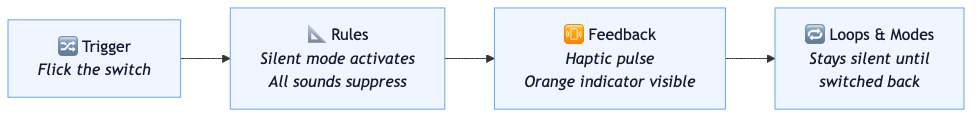

*Dan Saffer's four components of a microinteraction, applied to the iPhone silent switch. Every microinteraction follows this sequence: something starts it (trigger), logic governs what happens (rules), the user learns it worked (feedback), and the system decides what happens next (loops & modes). The silent switch completed this entire cycle in under a second, without requiring the user to look at a screen.*

This is a chapter about why that's true, and why most teams get it backwards.

## Features vs. Feelings

If you asked a product team what their product *is*, they'd probably describe features. A project management tool is task lists, boards, timelines, reporting. A banking app is accounts, transfers, payments, statements. A messaging platform is channels, threads, direct messages, file sharing.

These are the things that appear on the marketing page. They're the things that get compared in spreadsheets when someone is choosing between competitors. They're the things the roadmap is built around.

But they're not what people remember.

Think about the last app you recommended to someone. Not for work — something you told a friend about because you genuinely liked using it. The reason you recommended it almost certainly wasn't a feature. It was a feeling. Something about the way it worked that you couldn't quite articulate but wanted other people to experience. That feeling has a mechanism, and it starts with an uncomfortable study about colonoscopies.

In 1993, Daniel Kahneman and his colleagues published a study that has quietly reshaped how we should think about experience design — though most product teams have never heard of it. The study involved colonoscopies, which is not the most glamorous entry point, but the finding is extraordinary.

Patients were asked to rate the discomfort of the procedure after it was over. You'd expect the rating to reflect the total amount of discomfort experienced — a longer, more painful procedure should rate worse than a shorter, less painful one. It didn't work that way. What mattered was two things: the most intense moment of pain (the peak), and how the procedure ended (the end). A longer procedure with a gentler ending was rated as less unpleasant than a shorter one that ended abruptly. Patients who experienced the longer procedure were also more likely to return for follow-ups. [3]

Kahneman called this the peak-end rule. People don't judge an experience by the sum or average of every moment. They judge it by its most intense point and by how it ended. The duration barely registers. A 2022 meta-analysis across multiple domains confirmed the effect holds broadly — this isn't a quirk of medical settings. It's how human memory works. [4]

Sit with that for a second. The length of the experience doesn't matter. The average quality doesn't matter. What matters is the most intense moment and the last moment. Everything else fades.

The implications for product design are significant and largely ignored. If people judge experiences by peaks and ends — not by the cumulative average — then the moments that matter most aren't the features. They're the moments of highest emotional intensity (positive or negative) and the final impression.

> **Figure 2.2 — The Peak-End Rule**

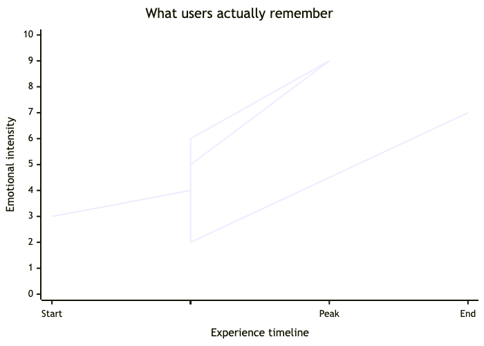

*Kahneman's peak-end rule: people judge an experience by its most intense moment (the peak) and how it ended — not by the average of every moment in between. The dotted middle of the experience barely registers in memory. This means a product's loading states, error messages, and success confirmations — the peaks and ends of task flows — carry disproportionate weight in how the entire product is remembered. A beautiful dashboard means nothing if the save action feels uncertain.*

And what creates those moments? Microinteractions.

The satisfying animation when a task is completed. The error message that makes you feel stupid. The confirmation screen that says "you're all set" with a small flourish. The loading state that leaves you in silence, wondering whether your data was lost. These are the peaks and ends of task flows, and they carry disproportionate weight in how the entire product is remembered.

## The Numbers Behind the Feeling

This isn't abstract. The data connecting small UX details to measurable outcomes is remarkably consistent.

Amazon found that every 100 milliseconds of additional page load time cost them 1% of sales. Google discovered that a half-second slowdown in search results — caused by showing 30 results instead of 10 — reduced traffic by 20%. When mobile load times increase from one to three seconds, the probability of a user bouncing rises by 32%. Stretch that to five seconds and the bounce probability increases by 90%. [5]

These are millisecond-level changes producing percentage-point shifts in revenue. Not redesigns. Not feature launches. Fractions of a second.

> **Figure 2.3 — The Cost of Waiting**

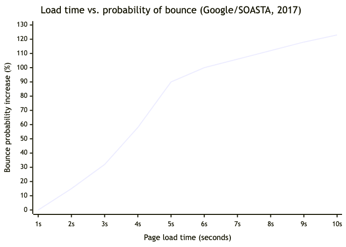

*Google's 2017 research with SOASTA measured how page load time affects the probability of a user leaving before the page finishes loading. The curve is not linear — it accelerates. From one to three seconds, bounce probability rises 32%. From one to five seconds, it rises 90%. Every additional second of load time costs more than the one before it. This is why Chapter 9 treats loading states as an emotional design problem, not just a performance one.*

The pattern holds beyond speed. Form design research consistently shows that reducing the number of fields increases completion rates — in some cases dramatically. The principle is simple: every field is a decision, and every decision is friction. Remove the friction and more people finish the form. [6]

Adobe's 2024 research found that 68% of users abandon products that feel inconsistent — not products that are broken, products that *feel* inconsistent. The distinction matters. A page can function correctly and still feel wrong if the loading state is absent, the feedback is delayed, or the visual response to interaction is missing. [7]

Forrester's research on UX investment puts the return at up to $100 for every $1 spent — a 9,900% ROI — driven primarily by avoided redesigns, reduced churn, and the compound effect of many small improvements rather than a single dramatic overhaul. [8]

None of these numbers are about features. They're about the texture of the experience — the speed, the feedback, the micro-moments between intention and outcome. They're about the small stuff.

## The Affect Heuristic

You've opened an app and something felt slightly off — maybe the animation stuttered, or a screen took a beat too long to load — and from that point on, you trusted it a little less. Not consciously. You didn't write a review or file a bug report. You just... used it with slightly less confidence. There's a name for that.

The affect heuristic is the observation that people make judgments based on current emotional state rather than careful analysis. If something makes you feel good, you tend to rate it as less risky, more beneficial, more trustworthy. If something makes you feel bad, you rate it as more dangerous, less useful, less reliable. The feeling comes first; the reasoning follows, and it follows in the direction the feeling pointed. [10]

This means a microinteraction that leaves someone feeling positive doesn't just improve that one moment — it colours the perception of everything around it. A product with a few genuinely delightful microinteractions gets rated as more reliable, more trustworthy, more polished, even in areas that have nothing to do with those specific interactions.

The reverse is also true. A single frustrating microinteraction — a confusing toggle, an error that feels like an accusation, a save flow that doesn't confirm whether it worked — casts a shadow over the whole experience. The user doesn't think "that one interaction was bad." They think "this product feels bad."

> **Figure 2.4 — The Affect Heuristic Feedback Loop**

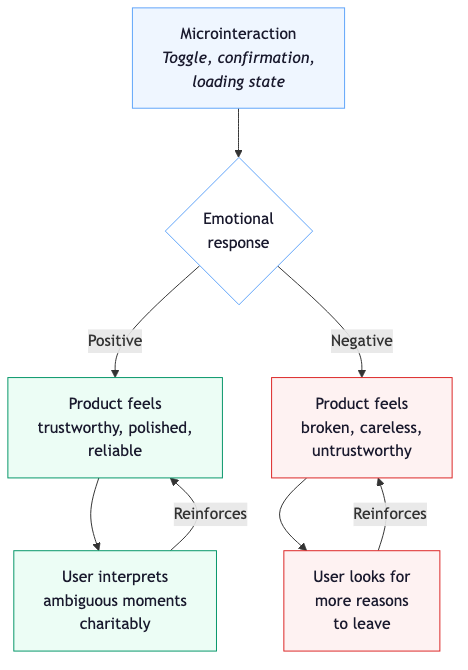

*The affect heuristic creates a self-reinforcing cycle. A positive microinteraction produces a positive feeling, which makes the user interpret the next ambiguous moment charitably — which reinforces the positive impression. A negative microinteraction does the reverse. This is why one bad error message can colour an entire session, and why one moment of delight can buy goodwill for minutes afterwards. The feeling comes first; the judgment follows.*

This is why that 39% abandonment stat exists. Users aren't performing a technical audit. They're having a feeling — and the feeling is telling them something is wrong, even if they can't articulate what.

The small stuff isn't decorating the product. It *is* the product, emotionally, because emotion is the lens through which everything else gets evaluated.

## What Happens Between the Features

Try this. Put the book down for a minute and open your banking app. Not to do anything — just to count. From the moment you tap the icon to the moment you see your balance, count every distinct thing that happens. Every prompt, every loading state, every animation, every screen.

You'll hit at least four before you've seen a single number — hopefully, if your bank is doing it right.

Here's what you probably found. You tapped the icon and hit a biometric prompt — Face ID, fingerprint, maybe a PIN. That's one. Then a loading state — a spinner, a skeleton screen, or maybe nothing at all, just a blank pause. That's two. Then the moment the balance appeared — did it animate in? Snap into place? Did it feel secure or oddly exposed? Three. Then the layout that presented it — the hierarchy, the clarity, the emotional register of the screen. Four.

That's four microinteractions before you've even used a feature. If the biometric fails and the error is cryptic, you're already annoyed. If the balance loads instantly with a clean, confident presentation, you feel like the bank knows what it's doing. Remember: affect heuristic. That feeling of competence transfers to your trust in the bank itself, not just the app.

Now make the transfer. You're going to experience: form input behaviour (does it format the amount as you type?), recipient selection (does it remember recent payees?), the confirmation step (is it clear what's about to happen?), and the success state (did it work? how do you know? what happens next?).

Four more. Each one is a tiny emotional event. Each one either builds trust or erodes it. And none of them are the feature. The feature is "transfer money." The experience is everything that happens while you're doing it.

> **Figure 2.5 — The Microinteractions Hidden Inside "Check Balance"**

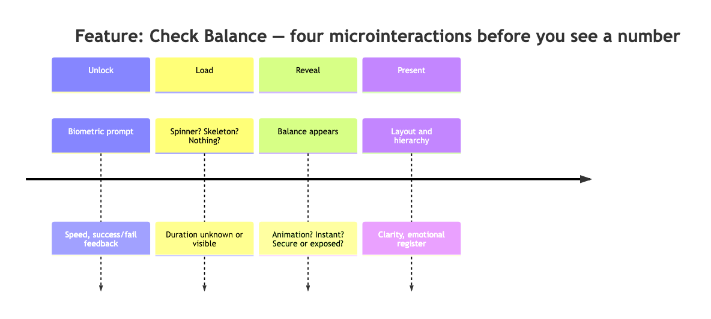

*A single feature — "check your balance" — contains at least four microinteractions before the user has seen a number. Each one is a tiny emotional event that either builds or erodes trust. The feature is the destination; the microinteractions are the journey. Most teams design the destination. The best teams design the journey.*

This is what I mean when I say the small stuff is the product. Not that features don't matter — of course they do. But features are table stakes. Every competitor has roughly the same ones. The difference between a product you tolerate and a product you trust lives in the microinteractions.

## The Slack Loading Screen

Slack does something that, on paper, sounds pointless. When the app is loading, it shows you a short message — a quip, a fun fact, a small moment of personality. The messages cycle. You see them for a few seconds, maybe less, and then the app loads and they disappear.

From a features perspective, this is nothing. It's not functionality. It's not on any comparison spreadsheet. It doesn't appear in the product tour. It doesn't solve a problem.

From a microinteraction perspective, it's doing several things at once. It's providing feedback during a wait state — something is happening, the app isn't frozen. It's setting an emotional tone — this is a product with personality, not a grey corporate tool. And it's managing the peak-end rule in reverse — the loading screen is the *beginning* of every session, and a moment of warmth at the start colours everything that follows.

Slack could show a spinner. Every other enterprise tool does. The decision to show a message instead is a microinteraction decision, and it's one of the things people mention when they talk about why Slack feels different from its competitors. Not channels, not threads, not integrations. A loading screen.

## The Kitchen Pass

There's a concept in restaurant kitchens called the pass. It's the counter where finished dishes are placed before they go out to the table. It's the last checkpoint — the head chef looks at every plate, adjusts a garnish, wipes a smear from the rim, checks the temperature. The pass isn't where the cooking happens. It's where the care becomes visible.

A dish can be technically perfect and still fail at the pass. Wrong plate, sloppy presentation, sauce pooling where it shouldn't. The diner doesn't know about the reduction that took four hours or the stock that was made from scratch. They see the plate. They see the garnish. They see whether someone paid attention in the last ten seconds before it left the kitchen.

Microinteractions are the pass. They're the last thing between the engineering and the experience. A feature can be technically sound — correct data, fast response, no bugs — and still feel careless if the loading state is an afterthought, the success message is generic, and the transition is abrupt. The user doesn't know about the architecture. They experience the pass.

This is why treating microinteractions as polish — something you add at the end if there's time — fundamentally misunderstands what they are. They're not the garnish. They're the presentation. And presentation is, whether we like it or not, inseparable from the meal.

## The Spreadsheet Problem

If microinteractions matter this much — and the data says they do — why do most teams underinvest in them?

The answer is measurement. Features are easy to count. You can put them in a roadmap, check them off, compare them to the competition. "We shipped 12 features this quarter" is a sentence that makes sense in a slide deck. "We improved the emotional register of 40 microinteractions" is not.

This creates a structural bias. The things that get funded are the things that can be counted, compared, and presented. Features qualify. Microinteractions don't, because their value is emotional and cumulative. No single microinteraction will move a retention metric on its own. But the collective quality of hundreds of them absolutely will — which is exactly what the Forrester and Google data shows. The return isn't from one dramatic change. It's from many small ones compounding.

Kahneman's peak-end rule is essentially a warning label for this bias. It says: the things people remember and judge you by are not the things you're measuring. You're measuring duration and volume (features shipped, tasks completed). They're judging by peaks and ends (the best moment, the worst moment, and the last moment).

The Baymard Institute's research makes this concrete. Their studies consistently show that the average online shopping cart abandonment rate sits around 70% — and the primary drivers aren't missing features. They're friction in the checkout process: unclear error messages, unexpected costs appearing late, too many form fields, confusing validation. Microinteraction failures, every one of them. [11]

This doesn't mean teams should stop building features. It means the definition of "done" should expand. A feature isn't finished when it works. It's finished when every microinteraction within it — the trigger, the loading state, the feedback, the success, the failure, the edge case — has been considered with the same seriousness as the logic underneath.

## Small by Design

Dan Saffer's framework is useful here because it makes the invisible visible. When you break a microinteraction into trigger, rules, feedback, and loops, you create a vocabulary for discussing things that teams usually wave away with "polish it later."

"What's the trigger?" is a design question. Is it manual or automatic? Does the user initiate it or does the system? A pull-to-refresh is a manual trigger with a specific gesture. A notification badge is a system trigger with a visual cue. Each demands different design thinking.

"What are the rules?" is a logic question. What constraints govern this moment? A character counter on a text field is a rule made visible. A password strength indicator is a rule made helpful. A form that silently truncates input without telling you is a rule made hostile.

"What's the feedback?" is the emotional question — and the one most often neglected. How does the user know something happened? A button that doesn't change state when clicked leaves you wondering if you clicked it. A toggle that animates smoothly between states tells you exactly what happened and where you are. A save action that produces no confirmation at all leaves you with a specific kind of anxiety that Kahneman would recognise as a negative peak.

"What are the loops and modes?" is the longevity question. Does this interaction change over time? Does it learn? Does it adapt? A greeting that says "Welcome back" every single time becomes wallpaper. One that says "Welcome back — you left off on Chapter 3" respects the returning user's context.

These are small questions. They concern small things. That's the point. The small things are where the feeling lives, and the feeling — backed by Kahneman's peaks, Forrester's ROI, Amazon's milliseconds, and Google's bounce rates — is what people remember.

## The First One That Matters

If the small stuff is the product, then the question becomes: where do you start?

You can't fix every microinteraction at once. You can't audit every loading state, every error message, every toggle and transition in a single sprint. So you pick the one that matters most. The one with the highest emotional stakes, the one that sets the tone for everything that follows.

For most products, that's the moment someone comes back. Not the first visit — the return. The point where a stranger becomes a regular, where a user becomes a person, where the product has a chance to say: *I remember you*.

Most products waste it.

## References

[1] Apple replaced the Ring/Silent switch with the Action Button on iPhone 15 Pro in September 2023. The original switch had been present on every iPhone since the first model in 2007. [MacRumors — Switch Between Mute/Silent and Ring Mode](https://www.macrumors.com/how-to/switch-between-mute-silent-ring-mode-iphone-16/).

[2] Saffer, D. *Microinteractions: Designing with Details*. O'Reilly Media, 2013. [O'Reilly](https://www.oreilly.com/library/view/microinteractions/9781449342760/).

[3] Kahneman, D. et al. "When More Pain Is Preferred to Less: Adding a Better End." *Psychological Science*, 4(6), 401–405, 1993. Overview at [Wikipedia — Peak-End Rule](https://en.wikipedia.org/wiki/Peak%E2%80%93end_rule).

[4] Cojuharenco, I. & Ryvkin, D. "All's Well That Ends (and Peaks) Well? A Meta-Analysis of the Peak-End Rule and Duration Neglect." *Organizational Behavior and Human Decision Processes*, 170, 2022. [ScienceDirect](https://www.sciencedirect.com/science/article/abs/pii/S0749597822000334).

[5] Amazon load time: Greg Linden, "Make Data Useful" presentation at Stanford — every 100ms cost 1% of sales, from A/B tests at Amazon (1997–2002). Google traffic: Marissa Mayer at Web 2.0 Conference, November 2006 — half-second increase reduced traffic by 20%. Google bounce rate: "Find Out How You Stack Up to New Industry Benchmarks for Mobile Page Speed," Google/SOASTA Research, 2017.

[6] Form field research: reducing fields consistently increases completion rates. See Google's "Designing Usable Web Forms" (CHI 2014) and general form optimisation literature.

[7] Adobe 2024 research: 68% of users abandon products that feel inconsistent. [The Business Value of Design Systems in 2025, Medium](https://medium.com/@sachhsoft/the-business-value-of-design-systems-in-2025-why-ux-consistency-drives-growth-b0a18f7da959).

[8] Forrester Research. "The Six Steps For Justifying Better UX." ROI of up to $100 for every $1 invested in UX. [Eficode — Achieving ROI with UX Design](https://www.eficode.com/blog/achieving-roi-with-ux-design).

[9] Slovic, P. et al. "The Affect Heuristic." *European Journal of Operational Research*, 177(3), 1333–1352, 2007.

[10] Baymard Institute. Cart abandonment rate research — average rate of approximately 70%, primary drivers relate to checkout UX friction. [Baymard — UX Statistics](https://baymard.com/learn/ux-statistics).

---

# Hello Again: Designing the Welcome Back Moment

There's a pub near our house that my wife and I go to most weeks. It's nothing special — good beer, decent food, a few tables by the window. We've been going long enough that the staff know us by name. When we walk in with the dogs, there's a nod, our drinks are started before we've sat down, and someone's already reaching for the treat jar behind the bar. The dogs get fussed over — strokes, ear scratches, the full works. We get asked how the week's been. Sometimes it's a five-minute chat. Sometimes it's just a nod and a pint. They read the room.

It takes five seconds. It costs them nothing. And it is, without exaggeration, one of the reasons we keep going back. Not the beer — the beer is good but there are other pubs within walking distance that pour the same thing. We go back because being recognised feels different from being served. One is a transaction. The other is a relationship. The dogs get treats at home too, but they still pull toward the pub door.

Every product has a version of this moment. The instant a returning user opens the app, logs back in, or lands on the homepage for the second time. It's the point where the product has a choice: treat them like a stranger, or treat them like a regular.

Most products treat them like a stranger.

## The Science of Familiarity

In 1968, Robert Zajonc published a study that demonstrated something deceptively simple: people develop a preference for things merely because they are familiar with them. He called it the mere-exposure effect. [1]

Zajonc showed participants a series of stimuli — Chinese characters, nonsense words, photographs of faces — and varied how many times each one appeared. Afterwards, he asked participants which ones they preferred. The answer was consistent: the ones they'd seen more often. Not because they were objectively better. Not because participants could even remember seeing them. Simply because repeated exposure had made them easier to process, and that ease produced a positive feeling.

The mechanism underneath is called perceptual fluency. Each time the brain encounters something familiar, it processes it faster. That speed of processing feels good — it registers as a kind of cognitive comfort. The brain interprets "I processed that easily" as "I like that." It doesn't distinguish between recognising a face and recognising a layout. Familiarity is familiarity. [2]

A meta-analysis of mere-exposure research found something even more striking: stimuli presented subliminally — for just five milliseconds, below the threshold of conscious awareness — produced *larger* exposure effects than stimuli people could consciously see. You don't even have to know you've encountered something before for the familiarity to work. [3]

Let that settle. Five milliseconds. Below conscious awareness. And it still makes you like something more.

> **Figure 3.1 — The Mere Exposure Effect**

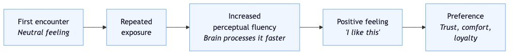

*Zajonc's mere-exposure effect: repeated encounters with a stimulus increase perceptual fluency — the brain processes it faster each time. That ease of processing is interpreted as a positive feeling, which accumulates into preference. This is why familiar layouts, consistent navigation, and remembered preferences all contribute to a product feeling trustworthy. The user doesn't think "I recognise this pattern." They think "I like this product." The mechanism is invisible; the feeling is not.*

This has direct implications for returning users. Every time someone comes back to a product and finds it familiar — the navigation is where they expect it, the layout hasn't rearranged itself, their settings are preserved — the mere-exposure effect is doing work. It's building preference through fluency, one visit at a time.

But familiarity is the floor. It's the minimum. Our local doesn't just look the same every week — they know our names and they've got treats behind the bar for the dogs. That's a different thing entirely.

## Recognition vs. Familiarity

There's a difference between a product that looks familiar and a product that knows you're back.

Familiarity is passive. It means the product hasn't changed in a way that disorients you. The buttons are where you left them. The colour scheme hasn't shifted overnight. Your muscle memory still works. This is important — and plenty of products fail at it, redesigning their navigation every quarter and breaking the perceptual fluency their users have built up — but it's not recognition.

Recognition is active. It means the product acknowledges that you, specifically, have returned. It remembers something about you. Your name. Your last session. Your preferences. Your progress. It says, in some small way: I know you were here before, and I'm glad you're back.

The difference between these two things is the difference between a pub that looks the same as last week and a pub where they're already pouring your usual and reaching for the dog treats before you've sat down.

Sixty-six percent of consumers say they'll stop engaging with a brand if their experience isn't personalised. Eighty-one percent prefer companies that offer personalised experiences. And 60% report they're more likely to become repeat customers after a personalised interaction. [4]

Those numbers are large, but they make intuitive sense. Being recognised is one of the most basic human social needs. Tajfel and Turner's social identity theory, developed through the 1970s and 80s, established that people derive self-esteem from belonging — from being part of a group and being acknowledged within it. Being greeted by name isn't just pleasant. It signals that you belong here, that you're not anonymous, that someone noticed you arrived. [5]

The dog walk from Chapter 1 is this in miniature. The man with the lurcher doesn't know my name. But he nods. He acknowledges I exist, that I'm a regular feature of the morning. That three-second nod is a recognition event, and it changes the texture of the entire walk.

Products can do this. Most don't.

## Two Users, One Login Screen

The simplest way to see the missed opportunity is to think about what happens when two different people open the same product.

**User A** has never been here before. They've just signed up, or they're on a free trial, or someone sent them a link. They don't know where anything is. They don't know the terminology. They might not even be sure what the product does yet. They are a stranger walking into a room full of people who all seem to know each other.

**User B** has been using the product for six months. They have projects, preferences, saved work, a history. They know where things are. They have context. They're the regular at the pub.

Most products show both of these people exactly the same screen.

The same generic dashboard. The same "Welcome to [Product]!" greeting. The same feature tour they've already dismissed three times. User A is overwhelmed because there's no orientation. User B is ignored because there's no recognition. The product has managed to fail both of them with a single screen.

The fix isn't complicated. It's two questions:

**For User A:** What is the one thing they need to understand right now to feel oriented? Not everything — one thing. A single clear next step. "Here's where your projects live. Create your first one."

**For User B:** What has changed since they were last here? What were they working on? What do they need to know? "Welcome back. Since Tuesday, three teammates commented on your design. Pick up where you left off."

> **Figure 3.2 — First Visit vs. Return Visit**

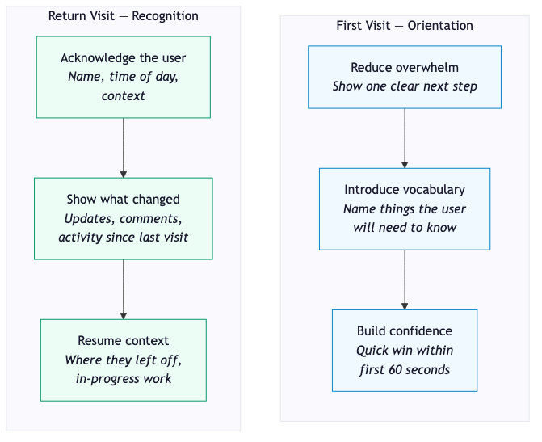

*Two entirely different design jobs, usually served by one screen. A first-time visitor needs orientation — reduction of overwhelm, clear vocabulary, a quick win. A returning user needs recognition — acknowledgement, context updates, and a path back to where they left off. Most products treat both identically. The ones that don't feel noticeably warmer.*

## The Anatomy of a Good Return

The best returning-user experiences share a few qualities. None of them are technically difficult. All of them are routinely neglected.

**Time awareness.** "Good morning" instead of "Welcome." It's a tiny thing, but a greeting that knows what time of day it is feels like it was written by a person. A greeting that says "Welcome to [Product]!" at 11pm on a Tuesday feels like it was written by a template.

**Context continuity.** "You were working on..." or "Pick up where you left off." This tells the user two things: the product remembers their state, and it respects their time. They don't have to navigate back to where they were. The product already knows.

**Gap acknowledgement.** "Since you were last here, three things changed." This is the one most products miss entirely. When a user has been away for a day, a week, a month — the world inside the product kept moving. Teammates commented. Deadlines passed. Data updated. Ignoring the gap forces the user to discover what changed by stumbling across it. Acknowledging the gap shows them, upfront, in a single glance.

**Appropriate warmth.** Not every return needs a celebration. A user who was here five minutes ago doesn't need "Welcome back!" — they need the screen they were just looking at. A user who hasn't been here in a month might genuinely benefit from a warmer re-entry. The tone should match the gap.

Companies that invest in this kind of personalisation see returns of up to 20% improvement in customer retention. Sixty-two percent of business leaders attribute improved retention directly to their personalisation efforts. [6]

These aren't features. They're microinteractions — small moments of recognition that compound over time, building the mere-exposure effect and the sense of belonging simultaneously.

## The Owl That Gave Up on You

Duolingo is fascinating because it gets the returning-user moment both right and wrong at the same time.

The right part: Duolingo is acutely aware that returning users exist in a danger zone. Their data shows that days two through ten are the critical window for churn — if someone makes it past that, they're likely to stay. So the entire product is engineered around the return. Streak counters. Progress bars. XP scores. The green owl, Duo, who greets you differently depending on how long you've been away.

The wrong part — or at least the controversial part — is how it handles absence. Miss a day and the app icon changes. The owl looks sad. Miss more days and the notifications escalate. "These reminders don't seem to be working," reads the final message before they stop. It turns out that this message — the one that sounds like the app is giving up on you — is one of their most effective re-engagement tools. People come back because they feel like Duolingo has abandoned them. [7]

This is recognition, technically. The product knows you were away. It acknowledges the gap. But the emotional register is guilt, not warmth. It's the difference between a friend who says "Good to see you, it's been a while" and one who says "Oh, so you finally decided to show up."

Both are personalised. Both acknowledge the return. Only one makes you feel good about coming back.

There's a line here that matters, and it connects to what Chapter 8 will explore in depth. Recognition should make the user feel seen, not surveilled. Welcomed, not guilt-tripped. The Duolingo owl knows you were gone — but the way it communicates that knowledge determines whether the return feels like coming home or reporting to a parole officer.

## Try This

Next time you open an app you use regularly — anything, not just a productivity tool — pay attention to the first five seconds. Does it acknowledge that you've been here before? Does it show you anything specific to your history, your context, your last session? Or does it show you the same screen it would show a complete stranger?

Then open a second app and compare. The difference, when you start looking for it, is stark. One feels like walking into a room where someone left the light on for you. The other feels like walking into an empty building and finding the light switch yourself.

## What the Pub Knows

The staff at our local have figured out something that most product teams haven't. Recognition doesn't require a loyalty programme, a personalisation engine, or a recommendation algorithm. It requires attention.

They know our names because they've paid attention to us enough times that the pattern stuck. They know we'll want a table by the window if there's one free. They know our dogs by sight, keep treats behind the bar, and make a fuss of them every time — which, if we're being honest, is at least half the reason the dogs drag us through the door. None of this is written down. There's no customer profile. There's just a group of people who noticed what mattered to their regulars and remembered it.

The digital equivalent is simpler than teams make it. You already have the data. You know when the user was last here. You know what they were working on. You know what changed since then. You know their name, their timezone, their preferences. The question isn't whether you *can* recognise a returning user — you have more information about them than the pub has about us. The question is whether you bother.

Every return is a micro-recognition event. A chance to say, in three seconds and twenty pixels: I know you. Welcome back. Here's where you were.

The dog walk nod. The drink that's started before you've sat down. The dogs that get their ears scratched before you've even ordered. The product that remembers.

It costs nothing. It changes everything.

## References

[1] Zajonc, R. B. "Attitudinal Effects of Mere Exposure." *Journal of Personality and Social Psychology Monograph Supplement*, 9(2), 1–27, 1968. [APA PsycNet](https://psycnet.apa.org/record/1968-12019-001).

[2] Perceptual fluency as the mechanism underlying the mere-exposure effect. [Simply Psychology — Mere Exposure Effect](https://www.simplypsychology.org/mere-exposure-effect.html).

[3] Bornstein, R. F. "Exposure and Affect: Overview and Meta-Analysis of Research, 1968–1987." *Psychological Bulletin*, 106(2), 265–289, 1989. Subliminal exposure findings discussed at [Wikipedia — Mere-Exposure Effect](https://en.wikipedia.org/wiki/Mere-exposure_effect).

[4] Personalisation statistics: 66% stop engaging without personalisation, 81% prefer personalised experiences, 60% become repeat buyers after personalised interaction. [Contentful — 40 Personalization Statistics, 2025](https://www.contentful.com/blog/personalization-statistics/).

[5] Tajfel, H. & Turner, J. C. "An Integrative Theory of Intergroup Conflict." *The Social Psychology of Intergroup Relations*, 33–47, 1979.

[6] 20% retention improvement and 62% of leaders attributing retention to personalisation. [Abmatic — Impact of Personalization on Engagement and Retention](https://abmatic.ai/blog/impact-of-personalization-on-user-engagement-and-retention).

[7] Duolingo's returning-user engagement strategy, streak mechanics, and "these reminders don't seem to be working" notification. [Quartr — Keeping the Streak Alive: The Story of Duolingo](https://quartr.com/insights/edge/keeping-the-streak-alive-the-story-of-duolingo). [Medium — How Duolingo Uses AI and Guilt](https://medium.com/@Smyekh/how-duolingo-uses-ai-and-guilt-to-keep-you-learning-a-language-6ac3e11b3e44).

---

# First Impressions in Milliseconds

My wife and I use Airbnb more than I'd like to admit. We've stayed in enough places to know that the moment you open the front door sets the tone for the entire trip.

Last year we booked a place in Norfolk. Nothing fancy on paper — no hot tub, the TV was small, the kitchen was cramped. But when we walked in, it was spotless. Bright. The hosts were Scottish, and they'd left little Scottish touches everywhere — shortbread, a handwritten welcome note, small details that told you a real person had thought about what it would be like to arrive here. There were welcome treats on the counter and a message that felt like it was written for us, not pasted from a template.

The place wasn't objectively the best we've stayed in. But we left with an amazing feeling about it, and we've talked about it since more than places that were bigger, fancier, and more expensive. The first impression — the cleanliness, the light, the personal touches — carried the entire stay. Every small annoyance (the cramped kitchen, the tiny TV) got interpreted charitably because the door had already told us: these people care.

The previous chapter was about what happens when someone comes back. This one is about what happens in the moment they first arrive — and why that moment has more power than it has any right to.

## Fifty Milliseconds

In 2006, Gitte Lindgaard and her colleagues at Carleton University published a study with a title that should be printed and taped above every designer's monitor: "Attention web designers: You have 50 milliseconds to make a good first impression." [1]

They ran three experiments. In each one, participants were shown web pages for very brief periods and asked to rate their visual appeal. The key finding: ratings at 50 milliseconds were highly correlated with ratings at 500 milliseconds. The judgments people made in a twentieth of a second were essentially the same as the ones they made with ten times more exposure.

Fifty milliseconds is not enough time to read a word. It's not enough time to process a layout consciously. It's barely enough time to register that you're looking at a screen at all. And yet, in that window, people have already formed an opinion about visual appeal — and that opinion is remarkably stable. It doesn't change much with more time. [2]

To put that in perspective: the average human blink takes between 100 and 400 milliseconds. You form a first impression of a website in less time than it takes to blink once.

> **Figure 4.1 — The 50ms Window**

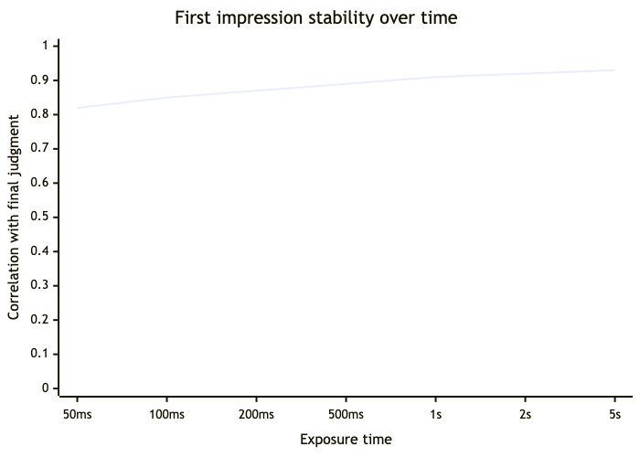

*Lindgaard's research showed that visual appeal ratings at 50ms correlated strongly with ratings given much longer exposure. The judgment forms almost instantly and barely shifts afterwards. The practical implication: by the time a user has consciously registered what they're looking at, they've already decided how they feel about it. Design isn't competing with other design for this first impression — it's competing with the speed of visual processing itself.*

## What Gets Judged

A study on health-related websites found that 94% of participant feedback about first impressions related to design — layout, colour, imagery, typography, spacing. Only 6% related to actual content. [3]

Read that again. Ninety-four percent design. Six percent content.

This doesn't mean content doesn't matter. It means content doesn't get a chance to matter if the design has already failed. Visual appeal is the gatekeeper. It determines whether a user stays long enough to read the first sentence, click the first button, give the product a chance. A site with brilliant content behind a poor visual impression doesn't get read. A site with mediocre content behind a strong visual impression gets the benefit of the doubt.

Seventy-five percent of users admit to judging a company's credibility based on its website design. Thirty-eight percent will stop engaging with a site entirely if the layout is unattractive. [4]

These numbers describe a filter, not a judgment of final quality. The 50ms impression doesn't tell the user whether the product is good. It tells them whether to stick around long enough to find out.

## Thin Slices

The 50ms finding would be remarkable in isolation, but it sits within a larger body of research on how quickly humans form judgments about almost everything.

In 1992, Nalini Ambady and Robert Rosenthal coined the term "thin slicing" — making inferences from very brief excerpts of behaviour. Their most cited experiment, published in 1993, showed participants silent video clips of university teachers. Some participants saw two seconds of footage. Others saw five. Others saw ten. Afterwards, all groups rated the teachers on a range of qualities. [5]

The results were striking in two ways. First, the ratings from two-second clips were remarkably similar to ratings from people who had spent an entire semester with those teachers. Two seconds was enough to predict end-of-semester evaluations. Second, there was no significant improvement in accuracy between two seconds and ten seconds. Whatever judgment was forming, it formed almost instantly.

Ambady and Rosenthal argued that expressive behaviours — posture, gesture, facial expression, spatial presence — communicate interpersonal information rapidly and often unintentionally. When verbal and nonverbal cues conflict, people trust the nonverbal. We can control what we say. We have a much harder time controlling how we look while we say it. [6]

For interfaces, the parallel is direct. The "nonverbal" of a product is its visual design — layout, spacing, colour, typography, motion. Users read these signals before they read a single word of copy. A button that says "Get Started" is verbal. The spacing around that button, the weight of its shadow, the contrast of its colour against the background — those are nonverbal. And they're processed first.

## The Halo Effect

Once a first impression forms, it doesn't just sit there passively. It actively shapes how everything that follows gets interpreted.

Edward Thorndike identified this in 1920 and called it the halo effect: a positive impression in one area spills over into unrelated areas. If someone is attractive, we tend to rate them as more intelligent, more competent, more trustworthy — without any evidence for those judgments. The positive glow from one trait radiates outward and colours everything. [7]

The halo effect is a form of confirmation bias. Once the initial impression is set, the brain looks for evidence that supports it and discounts evidence that contradicts it. A product that looks polished in the first 50ms gets the benefit of the doubt when something later goes slightly wrong. "Probably just a glitch." A product that looks cheap in the first 50ms gets the opposite treatment. Every subsequent hiccup confirms what the user already suspected: this thing isn't reliable.

This is the mechanism that connects everything we've been building. The peak-end rule from Chapter 2 explains what gets remembered. The affect heuristic explains how feelings shape judgments. The halo effect explains how the first feeling propagates through the entire experience. Together, they form a chain: **first impression → emotional lens → interpretation of everything that follows → final memory.**

> **Figure 4.2 — The Impression Chain**

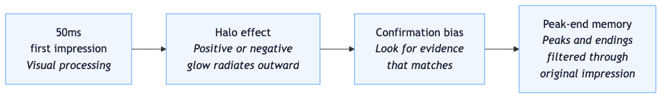

*The impression chain: a 50ms visual judgment creates a halo (positive or negative) that activates confirmation bias — the user then interprets every subsequent interaction through the lens of that first impression. When the experience ends, what gets stored in memory is the peak-end rule filtered through the original halo. This is why a visually polished product can survive occasional friction, and why a visually unpolished one struggles to recover even when the underlying quality is strong.*

This chain is why visual design isn't vanity. It's not about making things pretty for the sake of it. It's about setting the cognitive conditions under which every subsequent microinteraction will be evaluated. A well-designed first impression buys goodwill. Goodwill buys patience. Patience buys the user staying long enough to discover that the product is actually good.

## The Beautiful Fraud

There's a trap here, and it's worth naming it directly.

If first impressions are powerful enough to create a halo, then it's tempting to conclude that visual polish is all you need. Make it look good, and everything else will fall into place. Users will forgive friction, overlook errors, and tolerate poor performance — because the halo will carry you.

This doesn't work, and the research explains why.

The halo effect buys *patience*, not loyalty. A beautiful product that breaks on the second click doesn't get the user thinking "probably just a glitch" forever. It gets them thinking "this looks great but doesn't actually work" — which is worse than an ugly product that works, because it adds a feeling of betrayal. The promise didn't match the reality. Expectations were set high and then violated. The Lindgaard study found that aesthetics correlate with initial appeal — but aesthetics alone can't hide core friction. [8]

I've used products that were visually stunning and functionally infuriating. The design set my expectations so high that every small failure felt like a personal insult. The halo turned into a horn — Thorndike's term for the negative version of the same effect. One bad trait radiates outward and darkens everything.

The honest conclusion is that first impressions and microinteractions are not alternatives. They're the same system. The 50ms judgment sets the stage. The microinteractions — the loading states, the feedback, the error messages, the transitions — sustain what the first impression started. If the two are aligned, the product builds trust. If they contradict each other, the product builds resentment.

## Try This

Open two apps on your phone that do roughly the same thing — two note-taking apps, two calendars, two weather apps, anything where you have a choice. Don't use them. Just look at the home screen of each for a few seconds.

Which one do you trust more? Which one feels like it was made by people who care? You'll have an answer almost immediately, and it won't be based on features — because you haven't used any features. It'll be based on the same signals Lindgaard measured in 50ms: layout, colour, spacing, typography, the confidence of the visual choices.

Now use them both for a minute. Does the one you trusted more sustain that trust? Does the one you trusted less surprise you? The relationship between first impression and subsequent experience is the whole game.

## The Front Door

That Airbnb in Norfolk had a cramped kitchen and a small TV. On a feature comparison, it would lose to half the places we've stayed. But the front door — the clean surfaces, the light, the shortbread, the handwritten note — did the same work as Lindgaard's 50 milliseconds. It set expectations. It created a lens. And every small imperfection that followed got filtered through it.

The 50ms impression is the front door. It matters enormously — 94% of first impressions are about the door, and a bad door means the rest never gets experienced. But no one rebooks an Airbnb for the door. They rebook it for the stay.

The front door gets you inside. What keeps you there — the motion, the language, the feedback, the way things feel when they go right and when they go wrong — that's where the rest of this book is headed.

## References

[1] Lindgaard, G., Fernandes, G., Dudek, C. & Brown, J. "Attention web designers: You have 50 milliseconds to make a good first impression!" *Behaviour & Information Technology*, 25(2), 115–126, 2006. [ResearchGate](https://www.researchgate.net/publication/220208334_Attention_web_designers_You_have_50_milliseconds_to_make_a_good_first_impression_Behaviour_and_Information_Technology_252_115-126).

[2] Lindgaard et al. study methodology — visual appeal ratings at 50ms highly correlated with 500ms. [Taylor & Francis](https://www.tandfonline.com/doi/abs/10.1080/01449290500330448).

[3] 94% design-related first impressions. Study on health websites cited in [SAMPS — The Science of First Impressions](https://www.samps.org/blog/the-science-of-first-impressions-why-your-website-matters-more-than-you-think).

[4] 75% judge credibility on design; 38% stop engaging with unattractive layouts. [CXL — First Impressions Matter](https://cxl.com/blog/first-impressions-matter-the-importance-of-great-visual-design/).

[5] Ambady, N. & Rosenthal, R. "Half a Minute: Predicting Teacher Evaluations From Thin Slices of Nonverbal Behavior and Physical Attractiveness." *Journal of Personality and Social Psychology*, 64(3), 431–441, 1993. [MIT PDF](https://web.mit.edu/curhan/www/docs/Articles/15341_Readings/Self-presentation_Impression_Formation/Ambady_&_Rosenthal_1992_Thin_slices.pdf).

[6] Ambady & Rosenthal on nonverbal dominance when verbal and nonverbal cues conflict. [Simply Psychology — Thin-Slicing Judgments](https://www.simplypsychology.org/thin-slicing-psychology.html).

[7] Thorndike, E. L. "A Constant Error in Psychological Ratings." *Journal of Applied Psychology*, 4(1), 25–29, 1920. Overview at [Wikipedia — Halo Effect](https://en.wikipedia.org/wiki/Halo_effect).

[8] Lindgaard's findings on the limits of visual appeal — aesthetics cannot compensate for core usability friction. [NN/g — First Impressions and Automatic Cognitive Processing](https://www.nngroup.com/articles/first-impressions-human-automaticity/).

---

# Motion with Manners

We replaced our kitchen in 2020. Before, we had normal drawers — you pushed them shut and they shut. Sometimes they banged. Sometimes you had to give them a second shove because they bounced back off the frame. They worked. They were fine.

The new kitchen has soft-close drawers on everything. You push a drawer shut and it catches itself at the last moment — decelerates, eases into position, and clicks quietly closed. There is something deeply satisfying about the mechanism. You don't have to think about how hard to push. You don't have to worry about the slam. Every closure is the same: smooth, gentle, done. It's a tiny thing, and it has completely ruined me for normal drawers.

That mechanism is doing exactly what good animation does in an interface. It's not showing off. It's not drawing attention to itself. It's taking a moment that could be abrupt and making it gentle — and in doing so, it tells you something about the care that went into the thing you're using.

Motion in interfaces works the same way. When it's good, you barely notice it. When it's bad — or when it's missing — you feel it immediately.

## What Motion Is For

There's a useful distinction that thirty years of research has made clear: the difference between functional animation and decorative animation. They look similar. They do very different things to your brain.

Functional animation serves the user. It orients ("this panel slid in from the right, so swiping right will take you back"), provides feedback ("your file is uploading — see the progress bar"), shows state change ("this toggle just moved from off to on"), and maintains continuity ("this card expanded into this full screen — they're the same thing").

Decorative animation serves the designer's portfolio. Parallax scrolling that adds no information. Entrance animations that delay content. Background effects that move for the sake of movement. Elements that bounce, spin, or pulse because someone thought it would look cool in a case study.

The research on this is unambiguous. Over thirty years of educational psychology and HCI studies have shown that decorative animations increase cognitive effort and reduce memory performance. They make it harder to read, comprehend, and remember information. They are, in the language of cognitive load theory, a source of *extraneous load* — mental effort that doesn't contribute to understanding. [1]

Functional animation does the opposite. It reduces cognitive load by making transitions predictable. When a panel slides in from the right, you don't have to wonder where it came from or how to get back. The motion told you. When a progress bar fills, you don't have to wonder whether something is happening. The motion showed you. Functional animation answers questions before the user asks them.

> **Figure 5.1 — Functional vs. Decorative Motion**

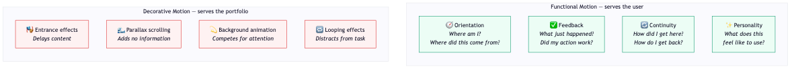

*The line between functional and decorative motion is whether it answers a question the user has. Orientation, feedback, continuity, and personality all serve the user's understanding. Entrance effects, parallax, background animation, and looping effects serve the designer's vision. The first category reduces cognitive load. The second increases it.*

## The iOS Zoom

Apple's approach to motion in iOS is one of the clearest examples of functional animation at scale.

When you tap an app icon on the home screen, the app doesn't just appear. It expands outward from the icon's position — a zoom effect that tells you where the app "lives" spatially. Close the app and it shrinks back to the icon. The animation creates a mental model: every app has a location on a grid, and opening it means expanding that location into a full screen. [2]

This is orientation through motion. You don't have to remember where an app is conceptually, because the animation tells you physically. When you press the home button (or swipe up), the reverse animation confirms: you're going back to where you were. The spatial relationship is maintained through movement.

Apple's Human Interface Guidelines describe the principle directly: motion should help people "build a mental model of how the product works" by mimicking real-world spatial behaviour. The ideal duration for most UI animation sits between 100 and 500 milliseconds — fast enough to feel smooth, long enough to communicate change clearly. [3]

Under a second. That's the window. Motion that lasts longer than a second starts to feel like it's wasting your time. Motion under 100 milliseconds is too fast to register as movement — it might as well be instant. The sweet spot is a fraction of a second, and within that fraction, the animation has to orient, reassure, and get out of the way.

The soft-close drawer again. It doesn't take three seconds to shut. It takes less than one. But in that fraction of time, it communicates: this was intentional, this was considered, and you don't need to worry about a bang.

## When Motion Hurts

Everything I've described so far — the soft-close mechanism, the iOS zoom, the 100–500ms sweet spot — assumes that the user can tolerate motion at all. For a significant number of people, they can't.

A study published by the National Institutes of Health found that as many as 35% of adults aged 40 or older in the United States — roughly 69 million people — have experienced some form of vestibular dysfunction. [4] Vestibular disorders affect the inner ear's balance system, and their symptoms include dizziness, nausea, disorientation, and migraines. These symptoms can be triggered by visual motion — including motion on a screen.

Parallax scrolling. Zoom transitions. Auto-scrolling carousels. Animations that move large areas of the screen. For someone with a vestibular disorder, these aren't design flourishes. They're physical assaults. A study on web accessibility found that upward of 35% of participants with vestibular disorders had difficulty using websites that featured heavy motion. [5]

Let that number land. More than a third of people with vestibular conditions — and vestibular conditions affect up to a third of adults over 40 — had difficulty using websites because of animation choices. Not because the sites were broken. Because someone decided a parallax scroll looked cool.

This isn't an edge case. This is a significant portion of the population being made physically uncomfortable — sometimes to the point of nausea or migraine — by decorative animation choices.

> **Figure 5.2 — The Scale of Motion Sensitivity**

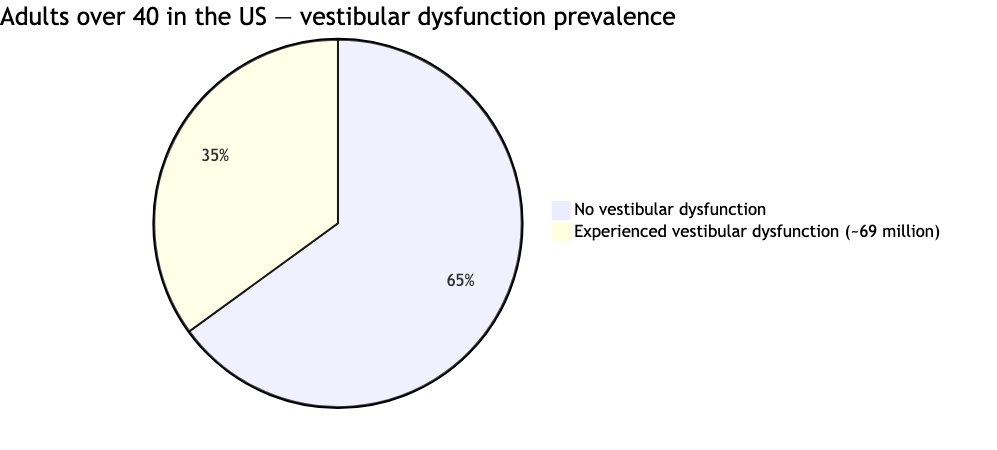

*The scale of motion sensitivity is larger than most teams assume. Up to 35% of adults over 40 have experienced vestibular dysfunction, and more than a third of those individuals report difficulty using motion-heavy websites. Vestibular prevalence rises with age and is two to three times more common in women. Decorative animation isn't just unnecessary for these users — it can cause physical symptoms including dizziness, nausea, and migraines.*

## Prefers Reduced Motion

The good news is that there's a solution, and it's been supported by every major browser for years.

The CSS media query `prefers-reduced-motion` checks whether the user has enabled a reduced-motion setting at the operating system level. Every modern OS has this option — iOS, Android, macOS, Windows. When it's enabled, your code can respond by reducing or removing motion. [6]

The key word is *reducing*, not removing. Reduced motion doesn't mean no motion. It means shorter durations, less distance, no parallax or zoom effects. A fade in is generally safe. A slide across the full width of the screen is not. The goal is to keep the functional benefits of motion (feedback, orientation) while eliminating the physical triggers (large movements, vestibular-disrupting effects).

WCAG 2.1 Success Criterion 2.3.3 makes this a formal standard: motion triggered by user interaction should be disableable unless it's essential to the functionality. [7]

Here's the thing that should make every developer uncomfortable: not adding `prefers-reduced-motion` support is a choice. It's a choice to prioritise a transition effect over someone's physical comfort. It's choosing to make a portion of your users feel sick because you liked how the page entrance looked. That's not a design decision. That's a failure of care.

And that's what this chapter — and this book — is really about. Motion with manners means considering the person on the other side of the screen. Not just the person with perfect vision, perfect balance, and a high-end device. The person who gets dizzy when things move too fast. The person whose migraine starts behind their left eye when a carousel auto-scrolls. The person who just wants the page to load without the room spinning.

## The Held Door

Think about the physical-world version of mannered motion. Someone walks through a door ahead of you and holds it open. They've added a small delay to their own journey — half a second, maybe less — to make yours smoother. They didn't slam it in your face. They didn't prop it open with a grand gesture and wait for applause. They just... held it. Briefly. Enough.

That's what good animation does. The iOS zoom holds the door between the home screen and the app. A progress bar holds the door between clicking "submit" and seeing the result. A toast notification that slides in gently and fades out after a few seconds holds the door between an event and the user's awareness of it.

The person who lets the door slam isn't evil. They're just not thinking about anyone behind them. The parallax scroll isn't evil. The auto-playing carousel isn't evil. They're just not thinking about the person who might get hurt.

Motion with manners means thinking about that person.

## Try This

Go into your phone's accessibility settings and turn on "Reduce Motion" (iOS) or "Remove animations" (Android). Then use your phone normally for an hour.

Notice what changes. Most apps will strip out their transitions — zooms become fades, slides become cuts. Some apps won't change at all, which tells you something about whether they checked. Pay attention to how the experience feels. Is anything lost? Is anything actually better? You might find that the reduced version is cleaner, faster, and less distracting — which raises an uncomfortable question about whether the full-motion version was serving you in the first place.

## The Soft Close

Animation in interfaces has the same job as those soft-close drawers in my kitchen. It's not there to impress anyone. It's not there to demonstrate engineering prowess. It's there to take a moment that could be abrupt and make it gentle. To take a transition that could be disorienting and make it clear. To take an interaction that could feel mechanical and make it feel human.

But the soft-close only works because it's brief, purposeful, and considerate of the person using it. A drawer that took three seconds to close would be infuriating. A drawer that closed differently every time would be confusing. A drawer that slammed shut for some people and closed gently for others, based on nothing they could control, would be cruel.

Good motion is brief. Good motion is purposeful. Good motion works for everyone — or at the very least, it doesn't hurt anyone.

That's manners. The next chapter applies the same principle to the cheapest, most powerful microinteraction a product has: the words it uses.

## References

[1] Over 30 years of research on decorative vs. functional animation and cognitive load. [Trevor Calabro — Most UI Animations Shouldn't Exist](https://trevorcalabro.substack.com/p/most-ui-animations-shouldnt-exist).

[2] iOS app-opening zoom animation as spatial orientation pattern. [IxDF — Disney's 12 Principles of Animation in UI Design](https://ixdf.org/literature/article/ui-animation-how-to-apply-disney-s-12-principles-of-animation-to-ui-design).

[3] Apple Human Interface Guidelines on motion: ideal duration 100–500ms, building mental models through spatial behaviour. [Apple Developer — Motion](https://developer.apple.com/design/human-interface-guidelines/motion).

[4] Vestibular dysfunction prevalence: ~35% of adults aged 40+ in the US (~69 million Americans). [PMC — Vestibular Dysfunction: Prevalence, Impact and Need for Targeted Treatment](https://pmc.ncbi.nlm.nih.gov/articles/PMC4069154/).

[5] 35%+ of participants with vestibular disorders had difficulty with motion-heavy websites. [A List Apart — Designing Safer Web Animation for Motion Sensitivity](https://alistapart.com/article/designing-safer-web-animation-for-motion-sensitivity/).

[6] `prefers-reduced-motion` media query — supported by all modern browsers. Best practice: reduce, don't remove. [Smashing Magazine — Designing With Reduced Motion for Motion Sensitivities](https://www.smashingmagazine.com/2020/09/design-reduced-motion-sensitivities/).

[7] WCAG 2.1 Success Criterion 2.3.3: Animation from Interactions. [W3C — Understanding SC 2.3.3](https://www.w3.org/WAI/WCAG21/Understanding/animation-from-interactions.html).

---

# Language That Respects People

My brother-in-law is autistic, and until recently didn't handle any of his own finances. He has a bank account set up by the council where he receives money for activities — a small charity runs the programme — and I'm the one who handles the payments each month.

One month, my login stopped working. I went to reset my password. The form let me change my username fine, but the password reset kept failing. No explanation. No hint. No error message beyond the fact that it didn't work. I tried different passwords — longer ones, shorter ones, with symbols, without. Nothing. The site still has `.aspx` in the URL. It's the kind of system that was built once, a long time ago, and never meaningfully touched since.

I spent the best part of a week trying to resolve it. I rang the company repeatedly until someone finally answered, and it turned out the password had to be a specific combination of uppercase letters, lowercase letters, and numbers in a format that was never communicated anywhere — not on the form, not in the error, not in the help text. The form knew exactly what it wanted. It just refused to say so.

That's a frustrating experience for me, and I build interfaces for a living. I knew it was probably a validation issue. I knew to try different formats. I knew to ring the company. But the form didn't know any of that about me, and it wouldn't have mattered if it did — because it told me nothing either way.

I'll come back to what happened next. But first, I want to talk about why a password field that can't explain its own rules isn't just bad design — it's a specific, well-understood failure that linguists have been studying since the 1980s.

Words are the cheapest, most powerful microinteraction a product has. They cost nothing to change. They require no engineering sprint, no design system update, no performance budget. And they carry more emotional weight than almost any other element on the screen.

## Face-Threatening Acts

In 1987, linguists Penelope Brown and Stephen Levinson published a theory of politeness that explains exactly what happened with that form. It's built on a concept from sociologist Erving Goffman: *face*. [1]

Every person, in every social interaction, maintains two kinds of face. **Positive face** is the desire to be liked, approved of, and respected — the need to feel competent. **Negative face** is the desire for autonomy and freedom from imposition — the need to feel in control of your own actions.

A **face-threatening act** is anything that damages either one. Telling someone they made an error threatens their positive face — it implies they're not competent. Forcing them to redo a task threatens their negative face — it imposes on their autonomy and time.

"ERROR: INVALID INPUT IN FIELD 3" is a double face-threatening act. It tells the user they got something wrong (positive face damaged: you failed) and forces them to figure out what, where, and why (negative face damaged: now do it again, with no help).

Brown and Levinson identified four strategies for managing face-threatening acts. You can be direct and blunt (bald on-record), which is what "INVALID INPUT" does. You can use positive politeness — affirm the person while delivering the correction ("Almost there — just needs a phone number without spaces"). You can use negative politeness — minimise the imposition ("You can fix this whenever you're ready"). Or you can go off-record — be indirect enough that the person can choose whether to engage. [2]

Most error messages in most products use the blunt strategy. They state the error in technical terms, offer no comfort, and leave the user to sort it out. They're face-threatening acts with no politeness strategy applied.

> **Figure 6.1 — Error Messages as Face-Threatening Acts**

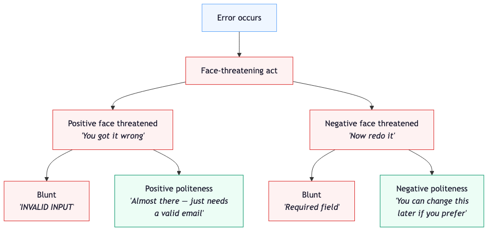

*Brown and Levinson's politeness theory applied to error messages. Every error is a face-threatening act — it damages the user's sense of competence (positive face) and imposes on their time (negative face). The blunt approach ("INVALID INPUT", "Required field") doubles the threat. Positive and negative politeness strategies reduce it — affirming the user's progress while minimising the imposition of correction.*

## Processing Fluency — Why Simple Words Build Trust

There's a cognitive mechanism that makes this even more important than social politeness.

Processing fluency is the observation that the easier something is to mentally process, the more true, trustworthy, and pleasant it feels. High fluency produces higher trust, lower anxiety, and better comprehension. Low fluency — dense text, technical jargon, unfamiliar terms — produces suspicion, stress, and disengagement. [3]

This matters most when things go wrong. In an error state, the user is already frustrated. Cognitive load is already elevated. Something didn't work and they don't know why. At this exact moment — when they are least equipped to parse complex information — many products serve them their most complex copy.

"Error 422: Unprocessable Entity." "Password validation failed: minimum length constraint not met." "Your session has expired due to inactivity. Please re-authenticate to continue."

Each of these is a fluency disaster. The user needs to know what happened and what to do. Instead, they get a technical explanation that requires them to translate from developer to human at the worst possible moment.

The fix is almost embarrassingly simple:

- "Error 422: Unprocessable Entity" → "Something went wrong. Please try again."
- "Password validation failed: minimum length constraint not met" → "Your password needs at least 8 characters."
- "Your session has expired due to inactivity. Please re-authenticate to continue" → "You've been signed out. Sign back in to pick up where you left off."

Same information. Half the cognitive load. The user recovers faster, feels less frustrated, and maintains trust in the product. Processing fluency isn't about dumbing things down — it's about respecting the mental state of the person reading.

## The GOV.UK Standard

The UK Government Digital Service has done more to demonstrate the power of respectful language at scale than any private company I'm aware of.

GOV.UK writes all public-facing content to a reading age of 9. Not because they think their users are children, but because research shows that 1 in 7 adults in England have literacy levels at or below Entry Level 3 — equivalent to the reading skills expected of a nine to eleven-year-old. That's millions of people who struggle with complex sentences, technical vocabulary, and dense paragraphs. [4]

The reading-age target is often misunderstood. Writing at reading age 9 doesn't mean writing for children. It means writing without unnecessary complexity. It means choosing "use" over "utilise," "about" over "approximately," "buy" over "purchase." It means short sentences. Active voice. No jargon unless it's genuinely unavoidable, and if it is, explain it.

Research conducted for GOV.UK found that 80% of people preferred sentences written in clear English — and the more complex the issue, the greater the preference. When tested with specialist legal language, 97% of people preferred "among other things" over the Latin "inter alia." [5]

That last number is worth pausing on. Ninety-seven percent. For a legal term that many professionals consider standard. The people reading it — including highly literate people — overwhelmingly preferred the plain version. Not because they couldn't understand the Latin. Because the plain version was faster to process, and that fluency felt better.

This is processing fluency at national scale. The UK government decided that every form, every guidance page, every piece of official communication would respect the person reading it enough to be clear. Not clever. Not comprehensive. Clear.

Not every system has caught up. Remember the password form from the start of this chapter — the `.aspx` site that wouldn't tell me what it wanted?

The consequence of that silent form was that the small charity running my brother-in-law's activity programme didn't receive their payment for an entire month. A real organisation, doing real work, didn't get paid — because a password field couldn't be bothered to list its own requirements.

And here's the part that stays with me. I resolved it. I rang repeatedly, got through eventually, figured out the format, reset the password, made the payment. But imagine my brother-in-law trying to do that without help. A form that won't explain what it wants. A phone line that doesn't answer. A system that assumes its users can tolerate an indefinite amount of frustration and have the confidence to keep trying.

That's not an edge case. That's a real person, trying to access money that's meant for them, blocked by a password field that refused to say "your password needs one uppercase letter, one lowercase letter, and one number."

Fourteen words. That's all it would have taken. Fourteen words and the charity gets paid on time.

GOV.UK shows what's possible when you decide to care about language. The `.aspx` form shows what happens when you don't.

> **Figure 6.2 — The Language Spectrum**

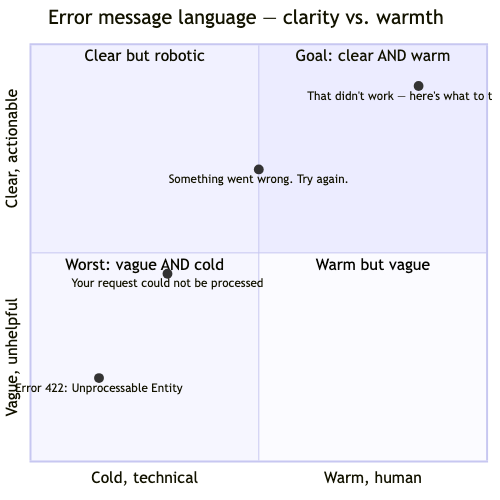

*The language spectrum from technical to human. Most error messages sit at the left — written in the language of the system rather than the language of the person using it. Moving rightward increases processing fluency, reduces face-threat, and makes recovery faster. You don't have to be casual or funny — plain and clear is enough. The goal is recovery, not personality.*

## Vulnerable Moments

Some forms ask for your name and email address. Others ask for your income, your medical history, your immigration status, or whether you have a criminal record. The emotional weight of microcopy scales with the vulnerability of the context.

A form that asks "Why are you applying for this benefit?" with a blank text area and no guidance is placing someone in a vulnerable position and offering no support. A form that says "Tell us briefly about your situation — for example, a change in employment or health. This helps us understand what you need" is asking the same question but doing it with care.

UX researcher Jennifer Aldrich documented a striking example: during a usability test, a user encountered an error message displayed as a giant red X with "ERROR" in capital letters. The user gasped, physically recoiled, and closed the browser immediately. A different version of the same message — "Something weird just happened on our end, sorry about that. Please refresh your screen and try that again" — produced a completely different response. [6]

Same error. Same user. Different words. The first version triggered a fight-or-flight response. The second produced a shrug and a refresh.

Words do this. Ten words, maybe twenty, can be the difference between a user who recovers and continues and a user who closes the tab and never comes back. In vulnerable contexts — health, finance, legal, employment — those ten words carry even more weight, because the person reading them is already under stress.

"Required field" tells the user nothing about why the information is needed or what happens to it. "We need this to process your application — it won't be shared" tells them both. The second version takes five extra seconds to write and removes an anxiety that the first version creates.

## The Words You Don't Write

Empty states are a special case. They're the screens a user sees when there's nothing to show — no results, no messages, no activity. Most products handle them by showing nothing, or by displaying a generic placeholder: "No results found." "You have no messages." "Nothing here yet."

These are small moments of failure, and they're opportunities. An empty search result that says "No results found" is accurate but unhelpful. One that says "No results for 'accessbility' — did you mean 'accessibility'?" is doing work. It's acknowledging the gap, suggesting a next step, and doing it without blame.

An empty inbox that says "You have no messages" states a fact. One that says "All caught up — nothing new since Tuesday" reframes the emptiness as an achievement. The user didn't fail to receive messages. They succeeded in reading them all.

These aren't major engineering challenges. They're copywriting decisions. They take minutes to implement. And they turn moments of blankness into moments of care.

## Try This

Open the product you work on — or any product you use regularly — and deliberately trigger an error. Enter an invalid email. Leave a required field blank. Submit a form with a mistake. Then read the error message out loud, slowly, as if you were hearing it for the first time.

Does it tell you what went wrong? Does it tell you how to fix it? Does it blame you? Does it use words you'd use in conversation, or words that belong in a server log?

Now rewrite it. Out loud, in the way you'd explain the problem to someone sitting next to you. "That email doesn't look quite right — it needs an @ in the middle." "This field needs filling in so we can send you a confirmation." "That didn't work — try a password with at least 8 characters."

The rewrite will almost always be better. Not because you're a writer, but because speaking to a person is naturally more respectful than writing for a system.

## Saying It Right

Language in a product is the closest thing to a human voice that an interface has. It's the moment where the machine stops being a machine and becomes, briefly, a person. And like any conversation, the way things are said matters at least as much as what's said.

"Invalid input" and "Almost there — just needs a valid phone number" communicate the same fact. One makes you feel like the form is fighting you. The other makes you feel like it's helping you.

"Required field" and "We need this to match your records" impose the same requirement. One demands without explanation. The other explains without demanding.

"No results found" and "Nothing matched — try fewer filters?" report the same outcome. One is a dead end. The other is a door.

Words cost nothing to change. They require no migration, no refactor, no sprint planning. They are the single most underinvested microinteraction in most products, and they have more power to make someone feel respected — or dismissed — than any animation, layout, or colour choice.

The soft-close drawer from the last chapter takes a physical moment and makes it gentle. Language does the same thing to an emotional moment. The next chapter looks at what happens when products try to make those emotional moments feel like wins.

## References

[1] Brown, P. & Levinson, S. C. *Politeness: Some Universals in Language Usage*. Cambridge University Press, 1987. [Wikipedia — Politeness Theory](https://en.wikipedia.org/wiki/Politeness_theory).

[2] Brown & Levinson's four politeness strategies: bald on-record, positive politeness, negative politeness, and off-record. [EBSCO — Politeness Theory](https://www.ebsco.com/research-starters/social-sciences-and-humanities/politeness-theory).

[3] Processing fluency: ease of mental processing produces feelings of trust, truthfulness, and pleasantness. [UX Bulletin — Processing Fluency in UX](https://www.ux-bulletin.com/processing-fluency-in-ux/).

[4] GOV.UK reading age 9 standard; 1 in 7 adults in England at Entry Level 3 literacy or below. [GOV.UK — Writing for GOV.UK](https://www.gov.uk/guidance/content-design/writing-for-gov-uk). [Storm ID — Content Accessibility: Speak Plainly](https://stormid.com/blog/content-accessibility-part-1-speak-plainly/).

[5] 80% preferred plain English; 97% preferred "among other things" over "inter alia." [GOV.UK — Writing for GOV.UK](https://www.gov.uk/guidance/content-design/writing-for-gov-uk).

[6] Jennifer Aldrich's usability testing observation — user physically recoiled from error message with red X and "ERROR" in caps. [UX Writing Hub — Best 10 Error Message Examples](https://uxwritinghub.com/error-message-examples/).

---

# Gamification, Wins, and Why Small Success Matters

I have a plug-in hybrid BMW. The MyBMW app tracks how much of my driving is done in eDrive — fully electric — compared to using the petrol engine. At the end of each month, it gives me a percentage breakdown and compares my usage to other hybrid drivers. It also hands out badges. Drive a certain percentage on electric and you earn one. Beat the average and you earn another.

Here's what's interesting: the percentage genuinely motivates me. Seeing that I did 78% electric last month makes me want to hit 80% this month. It's a mirror — it shows me my own behaviour in a way that makes the progress visible. I can feel the improvement. I know what levers I can pull (shorter journeys on electric, charging more often, planning routes differently).

The badges, on the other hand, I couldn't tell you what any of them are. I've earned several. I don't remember a single one. They arrive, I glance at them, they disappear into whatever screen stores them.

Same app. Same data. Same user. But one element makes me want to drive better and the other is wallpaper. The difference between those two things — between feedback that supports genuine motivation and rewards that sit on top of it doing nothing — is the subject of this chapter.

## The Science of Wanting to Try Again

In 2000, Edward Deci and Richard Ryan published the formal framework for Self-Determination Theory — the most comprehensive account of human motivation in modern psychology. It rests on three basic psychological needs. [1]

**Autonomy**: the need to feel in control of your own behaviour. Not that nobody helps you — that you're choosing to do this, not being compelled.

**Competence**: the need to feel effective and capable. Not that you're the best — that you're improving, that your effort produces results.

**Relatedness**: the need to feel connected to others. Not that everyone's watching — that someone cares how you're doing.

When all three needs are met, people experience intrinsic motivation — doing something because it is inherently satisfying, not because of an external reward. Intrinsic motivation is more durable, more resilient, and produces better outcomes than extrinsic motivation across virtually every domain that's been studied. [2]

The eDrive percentage hits all three. I choose how to drive (autonomy). I can see my improvement month to month (competence). And the comparison to other hybrid drivers gives me a reference point without turning it into a competition (relatedness — I'm part of a group, not racing against it). The badges hit none of them. They're tokens that arrive from outside the experience and sit there, disconnected from anything I actually care about.

> **Figure 7.1 — Self-Determination Theory: Three Basic Needs**

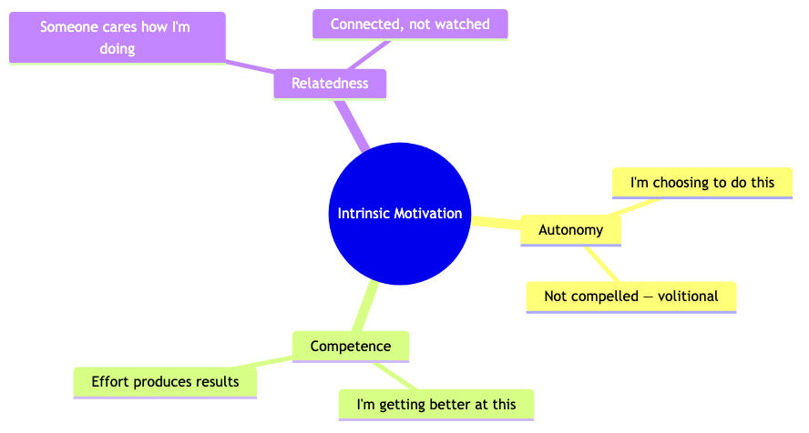

*Deci and Ryan's Self-Determination Theory: three basic psychological needs that, when met, produce intrinsic motivation. Autonomy means the user feels they're choosing, not being compelled. Competence means they can feel themselves improving. Relatedness means someone (or something) acknowledges their effort. Products that support all three create genuine engagement. Products that substitute external rewards for unmet needs create dependency.*

## The Felt-Tip Marker Study

In 1973, Mark Lepper, David Greene, and Richard Nisbett ran an experiment that should be required reading for every product team that's ever added a points system. [3]

They observed nursery-school children during free play and identified the ones who naturally gravitated toward drawing with felt-tip markers — children who drew because they enjoyed it. Then they split them into three groups.

The first group was told they'd receive a "Good Player" certificate with a gold seal and ribbon if they drew with the markers. The second group received the same certificate but without being told in advance — it was a surprise. The third group received nothing.

Two weeks later, the researchers observed the children during free play again. The second and third groups — surprise reward and no reward — drew with the markers just as much as before. The first group — the ones who'd been promised a reward for drawing — spent 50% less time drawing.

Children who loved drawing stopped drawing when you introduced a reward for it. The reward didn't increase their motivation. It replaced it. They'd been drawing because they enjoyed it. Now they were drawing for a certificate. When the certificate wasn't on the table, neither was the drawing.

Deci and Ryan call this the overjustification effect. An external reward for an intrinsically motivated behaviour shifts the person's understanding of why they're doing it. The internal reason ("I enjoy this") gets crowded out by the external one ("I'm doing this for the reward"). Remove the reward, and the behaviour collapses — because the original motivation has been overwritten. [4]

This is the trap that most gamification falls into. And it's exactly what BMW's badges are doing — or trying to do, and failing, because the intrinsic motivation (wanting to drive more efficiently) is strong enough that the badges can't overwrite it. They just sit there, ignored, while the percentage does the actual work.

## Points, Badges, and Leaderboards

The gamification industry is projected to reach $92.5 billion by 2030. [5] That's a lot of money being spent on points, badges, and leaderboards — the holy trinity of gamification, and the most superficial implementation of it.

Points, badges, and leaderboards (PBL) are pure extrinsic motivation. They sit outside the activity itself and say: do this, get that. Complete ten tasks, earn a badge. Beat your colleagues, climb the leaderboard. Maintain a streak, keep your counter going.

When PBL works, it works for one of two reasons. Either the user wasn't intrinsically motivated and the external reward provides enough reason to start (and hopefully, through starting, they discover intrinsic value). Or the gamification is well-designed enough to actually support autonomy, competence, and relatedness — the PBL is a surface layer over genuine need-satisfaction.

When PBL fails, it fails because it replaces motivation instead of supporting it. The user was interested in learning a language. Now they're interested in maintaining a streak. The user was interested in getting fit. Now they're interested in closing rings. The activity becomes the cost of the reward, not the reward itself.

Three-quarters of people prefer a visual indication of progress — and that's not surprising, because progress feedback supports competence. [6] But there's a difference between a progress bar that says "you've completed 7 of 10 lessons" (competence feedback) and one that says "complete 3 more lessons to earn a gold badge" (extrinsic reward). Same visual element. Different motivational mechanism. One supports the person. The other replaces their reason for being there.

## The Slot Machine in Your Pocket

The most effective reinforcement schedule in behavioural psychology is the variable ratio schedule. Coined by B.F. Skinner in his operant conditioning research, it means the reward is delivered after an unpredictable number of responses. [7]

Variable ratio reinforcement is the most resistant to extinction — the behaviour persists longer, even after rewards stop, because the person never knows if the next action might be the one that pays off. This is the mechanism behind slot machines. It's also the mechanism behind social media feeds, loot boxes, and pull-to-refresh.

A slot machine and a progress bar use different reinforcement schedules. A progress bar is fixed ratio — you know exactly what's required and exactly when the reward comes. A slot machine is variable ratio — you never know when the next win is. Fixed ratio supports competence (you can see your progress). Variable ratio exploits uncertainty (you can't stop because the next pull might be the one).

> **Figure 7.2 — Fixed Ratio vs. Variable Ratio Reinforcement**

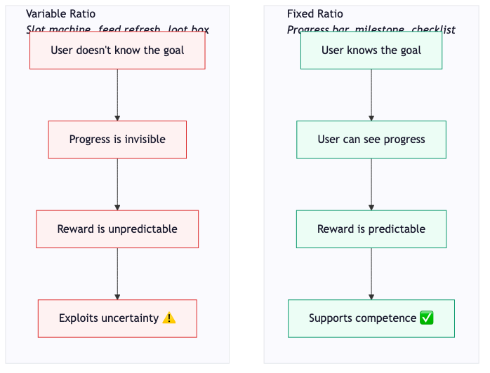

*Two reinforcement schedules, two completely different ethical registers. Fixed ratio reinforcement (progress bars, milestones, checklists) supports competence — the user can see where they are and what's needed. Variable ratio reinforcement (slot machines, feed refreshes, loot boxes) exploits uncertainty — the user keeps going because the next action might pay off. The mechanism is the same. The intent is opposite.*

## The Test

Here's a question that separates encouragement from manipulation, and it's simple enough to apply to any product feature:

**If you removed the gamification, would the user still want to use the product?**

If yes, the gamification is enhancing something real. The progress bar is showing genuine progress. The milestone celebration is marking genuine achievement. The streak counter is reflecting genuine consistency. The gamification is a lens on intrinsic value that already exists.

If no, the gamification is the only reason the user is here. The points are the point. The streak is the product. Remove them and the user leaves — not because the product failed, but because there was never anything behind the reward mechanism except more reward mechanism. That's a Skinner box.

Duolingo lives on both sides of this line. The lesson structure is genuinely well-designed — short, varied, progressively harder, with immediate feedback. That's competence support. The streak counter reflects genuine consistency. That's competence feedback. But the guilt-tripping notifications ("These reminders don't seem to be working"), the sad owl, the streak-freeze purchase — those are extrinsic pressure applied to intrinsic activity. They work, commercially. Whether they're kind is a different question — and one the next chapter takes up directly.

## What Good Gamification Looks Like

The best gamification in products is often so subtle you don't recognise it as gamification at all. It just feels like a product that notices your progress.

A writing app that shows your word count climbing in real time. A fitness tracker that shows your weekly trend, not just today's number. A project management tool that moves completed tasks to a "done" column where you can see the pile growing. A language app that shows you the percentage of a skill tree you've unlocked. A driving app that shows you 78% electric this month, up from 71% last month.

None of these are badges or leaderboards. They're mirrors. They reflect your effort back to you in a way that supports competence ("I'm making progress") and autonomy ("I can see the shape of what I'm building"). They don't add motivation from outside. They make the motivation that's already there visible.

E-learning courses with gamified elements see a 90% completion rate, compared to 25% without. [8] That's a striking number, but it matters what "gamified elements" means. If it means progress bars, clear milestones, and visible advancement — that's competence support. If it means points and badges bolted onto boring content — that's the felt-tip marker study waiting to happen.

## Try This

Think about a product you use that has any form of gamification — a streak, a progress bar, a badge system, a leaderboard, a point counter. Now ask yourself: do I use this product because of the gamification, or despite it? If the streak counter disappeared tomorrow, would I still open the app?

If the answer is yes, the gamification is doing its job — making your progress visible without becoming the reason you show up. If the answer is no, you're in a Skinner box. And you should think about whether you want to be.

## Seventy-Eight Percent

I'll keep trying to hit 80% electric next month. Not because of a badge — I genuinely can't remember what any of them look like. Because the percentage shows me something real about how I drive, and improving it feels like progress I chose to make.

That's all good gamification is. Making someone's progress visible to them, at the moment it matters, in a way that supports their sense of competence without replacing their reason for trying. A save confirmation that says "Draft saved — 1,200 words today." A task completion that briefly highlights the done pile. A monthly summary that shows the arc of improvement over time, not just today's score.

Small mercies. Moments where the product says, quietly: I see what you did. That was further than last time.

The next chapter asks what happens when that care is faked — when the same mechanisms that support motivation are turned against the user, and encouragement becomes manipulation.

## References

[1] Deci, E. L. & Ryan, R. M. "Self-Determination Theory and the Facilitation of Intrinsic Motivation, Social Development, and Well-Being." *American Psychologist*, 55(1), 68–78, 2000. [SDT founding paper](https://selfdeterminationtheory.org/SDT/documents/2000_RyanDeci_SDT.pdf).

[2] Cognitive Evaluation Theory (CET) as a sub-theory of SDT addressing intrinsic motivation. [selfdeterminationtheory.org](https://selfdeterminationtheory.org/theory/).

[3] Lepper, M. R., Greene, D. & Nisbett, R. E. "Undermining Children's Intrinsic Interest with Extrinsic Reward: A Test of the 'Overjustification' Hypothesis." *Journal of Personality and Social Psychology*, 28(1), 129–137, 1973. [ResearchGate](https://www.researchgate.net/publication/281453299_Undermining_children's_intrinsic_interest_with_extrinsic_reward_A_test_of_the_overjustification_hypothesis).

[4] Overjustification effect: children who expected a reward for drawing spent 50% less time drawing in subsequent free play. [The Decision Lab — Overjustification Effect](https://thedecisionlab.com/biases/overjustification-effect).

[5] Global gamification market projected to reach $92.51 billion by 2030, 26.02% CAGR. [InAppStory — Top Gamification Statistics 2025](https://inappstory.com/blog/gamification-statistics-2021).

[6] 75% of people prefer a visual indication of progress. [Mambo.io — Gamification Statistics and Trends](https://mambo.io/gamification-guide/gamification-statistics-and-trends).

[7] Skinner, B. F. Variable ratio reinforcement schedules — most resistant to extinction. [Simply Psychology — Schedules of Reinforcement](https://www.simplypsychology.org/schedules-of-reinforcement.html).

[8] E-learning courses with gamified elements: 90% completion rate vs. 25% without. [Engageli — 30 Gamification Statistics to Guide Your Learning Strategy, 2026](https://www.engageli.com/blog/game-based-learning-statistics).

---

# The Other Side of Craft

I tried to cancel a subscription last year. I won't name the company, but the experience was instructive. Signing up had taken about thirty seconds — name, email, card number, done. Cancelling required me to navigate through four separate screens, each offering a different reason to stay, a different discount, a different "are you sure?" before finally presenting a button labelled "Complete Cancellation" in grey text on a white background, next to a much larger, much brighter button labelled "Keep My Subscription."

The craft was impeccable. The screens were well-designed. The copy was polished. The visual hierarchy was deliberate — every pixel was placed to make cancellation harder and continuation easier. This wasn't a neglected corner of the product. Someone had spent real time on it. Someone had thought carefully about the flow, the friction, the placement of every element.

And every bit of that craft was pointed against me.

This chapter is about the shadow side of everything this book has discussed so far. Every technique — microinteraction design, visual hierarchy, processing fluency, recognition, feedback, motivation — has a dark version. The same skills that make a product feel warm can make it manipulative. The same attention to detail that creates a moment of care can create a moment of coercion.

The difference isn't the technique. It's who it serves.

## The Iliad Flow

In September 2025, the FTC secured a $2.5 billion settlement against Amazon — the largest in the agency's history at the time — over its Prime subscription enrolment and cancellation practices. [1]

The complaint alleged that Amazon had enrolled millions of consumers in Prime without their clear consent, and then made it deliberately difficult to cancel. The cancellation process required a four-page, six-click, fifteen-option sequence that included repeated offers to downgrade, discount prompts, and reminders of benefits about to be lost. Each page was designed to delay, confuse, or discourage the user from completing the cancellation.

Internally, Amazon called this the "Iliad Flow" — named after Homer's epic. [2]

Let that name sink in. The team that built the cancellation process named it after one of the longest, most arduous journeys in Western literature. They knew what they were building. They knew it was a slog. They named it accordingly — and shipped it anyway.

An estimated 35 million consumers were affected. The settlement required Amazon to pay $1 billion in civil penalties and $1.5 billion in consumer refunds, and to redesign the process so that cancellation is as simple as enrolment.

The Iliad Flow wasn't bad design. It was excellent design, applied in the wrong direction. Every principle of microinteraction craft — visual hierarchy, progressive disclosure, feedback loops, clear calls to action — was present. They were just aimed at the company's interests instead of the user's.

## Ninety-Seven Percent

In 2022, the European Commission conducted a study of the most popular websites and apps used by EU consumers. They found that 97% deployed at least one deceptive pattern. [3]

Ninety-seven percent. Not a handful of bad actors. Nearly all of them.

A separate FTC study in 2024 examined 642 websites and apps and found that 76% employed at least one possible deceptive pattern. [4]

These numbers suggest that dark patterns aren't aberrations — they're the default. The industry has normalised a set of practices that, when you examine them individually, are clearly manipulative. But because they're everywhere, they feel normal. That's the most insidious thing about them: prevalence creates a false sense of acceptability.

> **Figure 8.1 — The Dark Mirror**

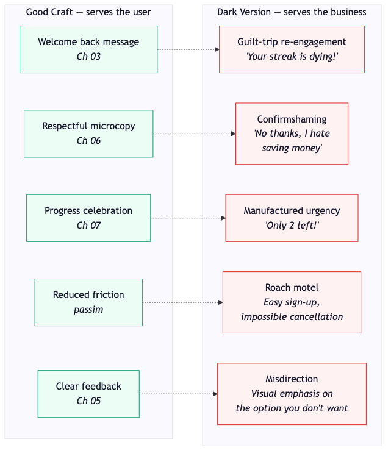

*Every technique in this book has a shadow version. Welcome-back messages become guilt trips. Respectful microcopy becomes confirmshaming. Progress celebration becomes manufactured urgency. Reduced friction becomes a roach motel. Clear feedback becomes misdirection. The craft is identical. The intent is opposite.*

## Confirmshaming

Chapter 6 was about language that respects people. Confirmshaming is its exact inverse.

Harry Brignull, the UX designer who coined the term "dark patterns" in 2010, defines confirmshaming as "the act of guilting the user into opting into something" where "the option to decline is worded in such a way as to shame the user into compliance." [5]

The examples read like satire, but they're all real. A popup offering a discount where the decline button reads "No thanks, I hate saving money." A coffee retailer whose sale dismissal link read "No, I'm OK with missing out on awesome deals." MyMedic, a company that sells first-aid kits, whose push notification opt-out genuinely read "No, I prefer to bleed to death." [6]

That last one sounds made up. It isn't. A first-aid company decided that the best way to get people to accept push notifications was to make the alternative sound like choosing to die. Someone wrote that copy. Someone approved it. Someone shipped it.

These are face-threatening acts — the same concept from Chapter 6's Brown and Levinson framework — deployed deliberately. The decline option threatens positive face: by clicking it, you're forced to identify with a statement that makes you sound foolish, reckless, or cheap. The goal is to make saying "no" feel worse than saying "yes," regardless of what the user actually wants.

It's the linguistic equivalent of the Iliad Flow. Make the exit uncomfortable enough and people won't use it.

The coffee retailer's net promoter score dropped more than 20% after implementing confirmshaming. [7] The short-term click-through went up. The long-term trust went down. The pattern worked as a mechanism and failed as a relationship.

## The Attention Economy

In 2013, a Google employee named Tristan Harris wrote an internal presentation titled "A Call to Minimize Distraction & Respect Users' Attention." It went viral inside the company. Two years later he left, and in 2018 he co-founded the Center for Humane Technology with Aza Raskin and Randima Fernando. [8]

Harris's argument is simple and uncomfortable: the business model of most technology companies is attention extraction. The product's success is measured by time spent, sessions per day, notifications opened. Every additional second of engagement is revenue. And the most effective way to extract seconds is to exploit the same psychological mechanisms that, in a different context, would be called good design.

Variable ratio reinforcement — the mechanism from Chapter 7 that makes slot machines addictive — is the mechanism behind infinite scroll. You don't know what's next, so you keep scrolling. The next post might be interesting. The next refresh might have something new. The unpredictability is the hook.

Intermittent social validation — likes, reactions, comments that arrive at unpredictable intervals — exploits the relatedness need from Self-Determination Theory. You check because someone might have responded. The "might" is the operative word. If you knew for certain there was nothing there, you wouldn't check. The uncertainty keeps you coming back.

These aren't failures of design. They're successes of design aimed at the wrong target. The craft is real. The intention is extraction.

## The Same Lab

Here's the detail that ties this chapter together and makes it uncomfortable in a way that can't be resolved with better intentions.

BJ Fogg founded the Stanford Persuasive Technology Lab. His Behavior Model — Motivation + Ability + Prompt — is the foundation of modern behaviour design. It's morally neutral. It describes how behaviour happens, not whether the behaviour is good. [9]

Tristan Harris studied at that lab. So did many of the designers who went on to build the engagement loops at Facebook, Instagram, and Google. The same research that Chapter 12 will use to discuss building healthy habits is the research that built infinite scroll and notification anxiety.

The model doesn't change depending on who uses it. Make the desired behaviour easy (high ability), increase motivation (social proof, fear of missing out, variable rewards), and trigger it at the right moment (push notification at 10pm). Whether this produces a meditation habit or a doom-scrolling addiction depends entirely on what the designer chooses to optimise for.

This means the techniques in this book are not inherently good. Microinteraction craft, visual hierarchy, processing fluency, recognition, feedback, motivation systems — all of them can be pointed in either direction. The knowledge that makes a product feel warm is the same knowledge that makes a dark pattern effective. The difference is a decision, not a skill.

## The Test (Revisited)

Chapter 7 proposed a test: if you removed the gamification, would the user still want to use the product? This chapter broadens it.

**Does this interaction serve the user, or the business at the user's expense?**

If the user had full information and zero pressure — if they could see exactly what was happening and choose freely — would they make the same decision? If yes, the design is honest. If no, the design is deceptive. The degree of deception varies, but the principle doesn't.

A progress bar that shows genuine progress: honest. A countdown timer that resets when you revisit the page: deceptive. A "Welcome back" message that shows what changed: honest. A "We miss you" notification designed to trigger guilt: deceptive. A cancel button that works in one click: honest. A four-page, six-click, fifteen-option Iliad Flow: deceptive.

The EU's Digital Services Act, Article 25, now makes this distinction legally binding. It explicitly prohibits designing interfaces that "deceive, manipulate, or materially impair users' ability to make free, informed decisions." [10] The FTC's $2.5 billion Amazon settlement signals the same direction in the US. What was once "aggressive UX" is becoming illegal.

The regulatory trend is clear: the only sustainable craft is honest craft. The techniques in this book aren't just ethically better than dark patterns — they're becoming the only legal option.

## Try This

Go to cancel something. Pick a subscription you don't use much — a streaming service, a newsletter, a free trial. Don't actually cancel it if you want to keep it. Just start the process and count the steps.

How many pages do you navigate? How many times are you asked to reconsider? Is the cancel button the same size and prominence as the "keep" button? Is there a countdown, a discount offer, a warning about what you'll lose? And does the flow match the design system used everywhere else on the site — the same button styles, the same layout patterns, the same visual language — or has it been quietly redesigned to work against you?

Now compare that to how many steps it took to sign up. The ratio tells you everything about whose interests the design is serving.

## The Choice

Every technique in this book is a tool. A soft-close drawer mechanism can ease a closing. It can also be used to make an exit so smooth you don't realise you've been led through it. A welcoming message can make someone feel recognised. It can also guilt them into returning. A progress bar can celebrate achievement. It can also manufacture urgency.

The craft doesn't change. The choice does.

This book is an argument for using these tools generously — to make products that feel warm, that respect people's time and attention, that treat small moments as opportunities for care rather than extraction. But it would be dishonest to pretend the same tools can't do the opposite. They can. Ninety-seven percent of popular websites prove it.

The next chapter moves from how products communicate to how they wait — and what happens in the anxious silence between an action and its result.

## References

[1] FTC secures $2.5 billion settlement against Amazon over Prime subscription practices, September 2025. [FTC Press Release](https://www.ftc.gov/news-events/news/press-releases/2025/09/ftc-secures-historic-25-billion-settlement-against-amazon).

[2] Amazon's "Iliad Flow" — four pages, six clicks, fifteen options to cancel Prime. [FairPatterns.ai — Amazon's $2.5B Dark Patterns Settlement](https://www.fairpatterns.ai/post/amazons-2-5b-dark-patterns-settlement-what-all-e-retailers-must-change-now). [Time — Amazon Reaches $2.5 Billion Settlement](https://time.com/7320708/amazon-prime-ftc-lawsuit-settlement-membership-subscription-cancel-dark-patterns/).

[3] EU Commission study (2022): 97% of most popular websites and apps deployed at least one deceptive pattern. [FairPatterns.ai — Dark Patterns Targeted by EU (2024)](https://www.fairpatterns.ai/post/dark-patterns-targeted-by-eu-institutions-a-new-era-of-digital-fairness).

[4] FTC study (July 2024): 76% of 642 websites and apps examined employed at least one deceptive pattern. [Built In — Regulating Dark Patterns](https://builtin.com/articles/dark-patterns-regulation).

[5] Harry Brignull coined "dark patterns" on 28 July 2010. Confirmshaming definition. [Deceptive.design — Confirmshaming](https://www.deceptive.design/types/confirmshaming).

[6] MyMedic push notification confirmshaming: "No, I prefer to bleed to death." [Built In — Confirmshaming](https://builtin.com/design-ux/confirmshaming).

[7] Majesty Coffee's NPS dropped more than 20% after implementing confirmshaming. [Built In — Confirmshaming](https://builtin.com/design-ux/confirmshaming).

[8] Tristan Harris — Google Design Ethicist, 2013 internal presentation, co-founded Center for Humane Technology in 2018. [Wikipedia — Tristan Harris](https://en.wikipedia.org/wiki/Tristan_Harris). [Center for Humane Technology](https://www.humanetech.com/).

[9] BJ Fogg's Behavior Model (Motivation + Ability + Prompt) and the Stanford Persuasive Technology Lab. [Fogg Behavior Model](https://www.behaviormodel.org/).

[10] EU Digital Services Act, Article 25 — prohibits designing interfaces that deceive, manipulate, or materially impair users' ability to make free, informed decisions. [IAPP — How US, EU Approach Regulating Dark Patterns](https://iapp.org/news/a/ongoing-dark-pattern-regulation).

---

# Waiting, Loading, and Anxiety

We booked flights to Mauritius last month — a friend's 50th birthday trip. They were not cheap. A significant amount of money for us, the kind of purchase where you check the total twice and take a breath before clicking. I'd found the fare, entered the details, double-checked the dates, and hit "Pay Now" — and then nothing. The screen went blank for about four seconds. No spinner. No progress bar. No message. Just a white screen and the growing certainty that something had gone wrong.

It hadn't. The payment went through fine. The confirmation loaded a few seconds later. But in those four seconds of silence, I'd already started composing the email to the airline, wondered whether my card had been charged twice, and considered whether I should refresh the page or whether refreshing would trigger a duplicate booking. On a purchase that size, four seconds of silence felt like an eternity.

Four seconds. That's all it took to go from "we're going to Mauritius" to "something is wrong and I might have just lost a lot of money." Not because anything was wrong. Because nobody told me anything was happening.

Waiting is an emotional event. The length of the wait matters far less than what happens during it.

## The Psychology of the Queue

There's a body of research on perceived wait time that dates back well before digital interfaces. Its central finding is consistent and counterintuitive: people don't experience time objectively. They experience it through the lens of uncertainty, engagement, and expectation. [1]

Active waiting — where the person is engaged, informed, or has something to process — is perceived as shorter than passive waiting, where the person sits in silence with no information. People in passive wait mode consistently overestimate how long they've been waiting compared to people in active wait mode, even when the actual duration is identical. [2]

Uncertainty is the amplifier. Not knowing whether something is working, how long it will take, or whether the action succeeded creates anxiety that stretches perceived time. Hick's Law formalises this: uncertainty about what is happening makes interactions feel longer than they are. [3]

This is why a GP's waiting room with a clock and a "Dr. Shah is running about ten minutes behind" update feels fundamentally different from one where you sit in silence with no information. Same wait. Same chairs. Completely different experience. The first waiting room has managed your uncertainty. The second has left you to manufacture your own.

The Mauritius booking was the second kind. Four seconds of blank screen, and my brain filled the silence with worst-case scenarios. A spinner would have helped. A message would have helped more. "Processing your payment — please don't close this page" would have turned an anxious void into a manageable pause.

## Four Hundred Milliseconds

In 1982, Walter Doherty and Ahrvind Thadani published a paper at IBM called "The Economic Value of Rapid Response Time." It established what's now known as the Doherty Threshold: when a system responds in under 400 milliseconds, users experience something close to flow — the interaction feels like an extension of their own thought. [4]

Above 400ms, the illusion breaks. The user becomes aware that they're waiting for a machine. Their mental buffer of planned actions starts to degrade. They have to think about where they were and what they were doing, rather than just doing it.

Doherty and Thadani found that keeping response times under 400ms didn't just feel better — it made people measurably more productive. The interaction became, in their word, "addicting." Not in the exploitative sense from the previous chapter, but in the sense that the tool disappeared and the work flowed.

> **Figure 9.1 — The Doherty Threshold**

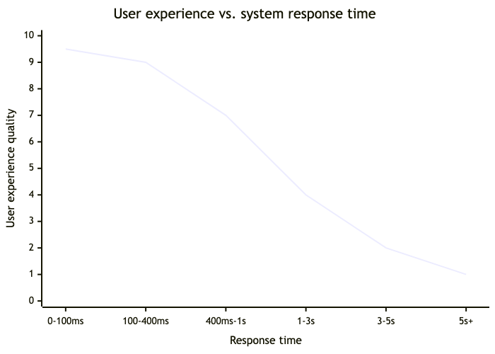

*The Doherty Threshold: system responses under 400ms keep users in a state of flow — the interface feels like an extension of thought. Between 400ms and 1 second, the delay is perceptible but tolerable. Beyond 1 second, users start to lose context. Beyond 3 seconds, they start to wonder whether something has gone wrong. Beyond 5 seconds, many will abandon the task entirely. The threshold isn't about speed for speed's sake — it's about preserving the user's mental continuity.*

Four hundred milliseconds is a useful line, but most real-world operations take longer. File uploads. Payment processing. Search queries across large datasets. API calls to third-party services. These are the moments where the interface has to do something with the gap — because the gap is where the anxiety lives.

## What to Do with the Gap

There are three broad strategies for managing wait states, and they represent a spectrum from minimal to generous.

**The spinner.** The lowest bar. A spinning indicator says "something is happening" — which is better than nothing but not by much. It answers one question (is the system frozen?) while creating another (how long will this take?). A spinner is an indeterminate wait — the user has no information about duration or progress. It's the digital equivalent of a receptionist who says "someone will be with you" without saying when.

**The progress bar.** A determinate indicator that shows actual progress. This answers both questions: something is happening, and here's how far along it is. Research consistently shows that determinate progress indicators outperform indeterminate ones in user satisfaction, because they convert uncertainty into expectation. You know where you are. You can see where you're going. [5]

**The skeleton screen.** A visual placeholder that shows the structure of the content that's about to appear. Skeleton screens feel 20% faster than spinners for identical wait times. They reduce uncertainty about both timing *and* outcome — the user can see what shape the result will take before it arrives. [6]

> **Figure 9.2 — The Wait State Spectrum**

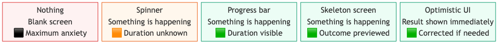

*The wait state spectrum, from maximum anxiety to minimum perceived delay. A blank screen provides no information — the user doesn't know if the system is working, how long it will take, or what the result will look like. Each step rightward reduces uncertainty. A spinner confirms activity. A progress bar shows duration. A skeleton screen previews the outcome. Optimistic UI removes the wait entirely by showing the expected result immediately and correcting only if something goes wrong.*

## Optimistic UI

The most generous approach to waiting is to not make the user wait at all.

Optimistic UI shows the expected result immediately, as if the operation has already succeeded, and then corrects if something goes wrong. When you send a message in most modern chat apps, it appears in the conversation instantly — it doesn't wait for server confirmation. The message is shown optimistically, and in the vast majority of cases, the server confirms a moment later. On the rare occasion it fails, the message is marked with an error state.

This works because most operations succeed. If 99% of messages send successfully, making 100% of users wait for confirmation punishes the majority for the sake of the minority. Optimistic UI inverts that: show success immediately, handle the 1% failure gracefully.

Immediate visual feedback reduces perceived wait time by up to 40%, even when actual processing time is identical. [7] The user doesn't perceive the wait because the result is already on screen. The operation is still happening — it's just happening behind a result the user already trusts.

There's a caveat, and it connects back to Chapter 8. Optimistic UI only works if failures are handled honestly. If the optimistic result masks a failure — if the message appears to send but silently doesn't — that's deception, not design. The pattern depends on trust: show the result early, but if it fails, tell the user immediately and help them recover.

## The Three Dots

The typing indicator in messaging apps — the three animated dots that appear when someone is writing a reply — is one of the most psychologically complex microinteractions ever designed.

It solves one problem brilliantly. Before typing indicators, you sent a message and waited in silence. You didn't know if the other person had seen it, if they were thinking about a reply, or if they'd walked away from their phone. The silence was ambiguous, and ambiguity breeds anxiety. The typing indicator resolves that: they're there, they've seen it, they're responding. The three dots transform "are they ignoring me?" into "they're writing back."

But it creates a new problem. The dots appear and disappear. The person starts typing, stops, starts again. You watch the dots pulse and wonder what they're writing that requires that much editing. The indicator that was meant to reduce uncertainty becomes a source of it — a real-time broadcast of someone's hesitation. [8]

This is worth sitting with, because it illustrates something important about wait-state design. Providing information during a wait is almost always better than silence. But the *kind* of information matters. The typing indicator provides too much — it shows process, not progress. It turns a simple wait ("they'll reply when they're ready") into a performance ("they're writing... they stopped... they're writing again...").

A progress bar doesn't show you the cursor moving back and forth across the screen. It shows you a bar filling up. It abstracts the process into progress. That abstraction is a kindness — it gives you enough information to feel oriented without enough to feel anxious.

## The Airport Board

Airports understand this better than most software.

A departures board manages uncertainty at scale. It shows hundreds of passengers the status of their flight in a single glance: on time, delayed, boarding, departed. Each status is a different anxiety level, and the board manages all of them simultaneously. "Delayed 20 minutes" is frustrating but manageable — you know what's happening and roughly when it will end. "Boarding at Gate 14" is a clear action. Even "Cancelled" is better than a blank row, because at least you know.

The worst state on a departures board is no information at all. A flight with no status listed creates more anxiety than one that says "Delayed" — because "Delayed" is a known quantity and blank is an unknown one.

Loading states work the same way. A blank screen after clicking "Pay Now" is the digital equivalent of a departures board with no information. Something is presumably happening, but the user has no way to know what, how long, or whether it's going to work. They fill the gap with their own worst-case thinking — just as I did with those Mauritius flights.

## Try This

Next time you're waiting for something to load — a payment, a file upload, a search result — time it. Not with a stopwatch. Just count in your head. One-Mississippi, two-Mississippi.

Now ask yourself: at what point did you start to feel uncertain? At what point did you wonder whether something had gone wrong? For most people, it's somewhere around three seconds. That's the threshold where passive waiting starts to feel like abandonment.

Then look at what the interface gave you during that wait. A spinner? A progress bar? A skeleton? A message? Nothing? Whatever it gave you, that's the product's answer to the question: do we care what you're feeling right now?

## The Blank Screen

The Mauritius flights worked. The payment went through. The confirmation appeared. But for four seconds, I didn't know any of that, and in those four seconds, the product lost something it never got back — not my money, but my confidence. Every subsequent interaction with that airline's website carried a faint residue of that moment. Will it work this time? Will it tell me if it doesn't?

The affect heuristic from Chapter 2 explains why: a negative emotional moment colours everything that follows. Four seconds of anxiety during a payment flow is a negative peak. And Kahneman's peak-end rule means it's the kind of moment that gets remembered disproportionately.

A progress message would have cost nothing. Eight words: "Processing your payment — please don't close this page." Eight words and the anxiety dissolves. Eight words and the user waits patiently instead of catastrophising. Eight words and the product keeps its trust.

It's the same lesson as Chapter 6's password field. A handful of words, plainly written, at the moment they're needed most. The cheapest fix. The most neglected one.

The next chapter is about what happens when the wait ends badly — when something genuinely goes wrong, and the product has to help someone recover.

## References

[1] Perceived wait time research — active vs passive waiting. [Chris Kiess — The UX of Waiting and the Perception of Time](https://chriskiess.medium.com/the-ux-of-waiting-and-the-perception-of-time-eab52c459ce3).

[2] People in passive wait mode overestimate duration compared to active wait. [ACM — Enhancing UX During Waiting Time in HCI (2012)](https://dl.acm.org/doi/10.1145/2317956.2318069).

[3] Hick's Law and uncertainty amplifying perceived wait time. [Dr Maria Panagiotidi — Psychological Time and UX](https://uxpsychology.substack.com/p/psychological-time-and-ux).

[4] Doherty, W. J. & Thadani, A. J. "The Economic Value of Rapid Response Time." *IBM Systems Journal*, 21(3), 1982. [Laws of UX — Doherty Threshold](https://lawsofux.com/doherty-threshold/).

[5] Determinate progress indicators outperform indeterminate ones in user satisfaction. [Prototypr — 7 Rules to Manage User Wait Times](https://blog.prototypr.io/7-rules-to-manage-user-wait-times-6dd44fec5b61).

[6] Skeleton screens feel 20% faster than spinners for identical wait times. [UI Deploy — Skeleton Screens vs. Spinners](https://ui-deploy.com/blog/skeleton-screens-vs-spinners-optimizing-perceived-performance).

[7] Immediate visual feedback reduces perceived wait time by up to 40%. [Simon Hearne — Optimistic UI Patterns](https://simonhearne.com/2021/optimistic-ui-patterns/).

[8] Typing indicator as a source of anxiety — resolves one uncertainty, creates another. [Pamela Pavliscak — Three-Dot Anxiety](https://medium.com/feels-guide/three-dot-anxiety-b1c9318ed27b). [Saratoga Falcon — Typing Awareness Indicator More Stressful Than Helpful](https://saratogafalcon.org/5988/features/typing-awareness-indicator-more-stressful-helpful/).

---

# Designing for Mistakes and Bad Days

I sent an email to the wrong person once. Not a catastrophic one — no state secrets, no career-ending confession — but the kind where the moment you click send, your stomach drops and your eyes go straight to the "To" field. Wrong client. Right message, wrong recipient. The kind of mistake that takes half a second to make and a very uncomfortable phone call to fix.

Gmail gave me five seconds. A small yellow bar at the bottom of the screen: "Your message has been sent. Undo." I clicked it. The email came back. Nobody saw it. The phone call never happened.

That feature — Undo Send — launched as a Google Labs experiment in March 2009. It offered a five-second window to recall a sent message. It stayed in beta for six years. Six years of quiet, unassuming usefulness before Google made it an official feature in 2015 and extended the window to thirty seconds. [1]

Five seconds. That's all the safety net was. But in those five seconds, Gmail turned a mistake into a non-event. Not by preventing the mistake — I still clicked send with the wrong name in the field — but by making the mistake recoverable. By treating the error not as a permanent action but as a reversible one. By giving me a moment of grace between the click and the consequence.

That's what this chapter is about. Not preventing mistakes — people will always make them. But designing products that treat mistakes as expected, recoverable, and human.

## Losses Loom Larger Than Gains

In 1979, Daniel Kahneman and Amos Tversky published Prospect Theory, one of the most influential papers in behavioural economics. Its central finding: people evaluate outcomes relative to a reference point and weigh losses more heavily than equivalent gains. The pain of losing something is psychologically about twice as powerful as the pleasure of gaining the same thing. [2]

Kahneman offered an evolutionary explanation: "Organisms that treat threats as more urgent than opportunities have a better chance to survive and reproduce." The asymmetry is baked in. Losing £50 feels worse than finding £50 feels good, even though the objective value is identical.

In interface design, this means losing work — an unsaved draft, an accidental deletion, a failed submission — is experienced not as a neutral absence but as an active loss. The emotional response is disproportionate to the objective cost. Losing a paragraph you spent ten minutes writing feels worse than the ten minutes of writing felt good. The endowment effect compounds this: once someone has created something, they value it more than they objectively should. It's theirs. Losing it hurts.

This is why undo, auto-save, and recovery patterns aren't nice-to-haves. They're loss-prevention mechanisms addressing a deep cognitive bias. A product without undo isn't just missing a feature — it's exposing users to a form of pain that the product could have prevented.

> **Figure 10.1 — Loss Aversion in Interface Design**

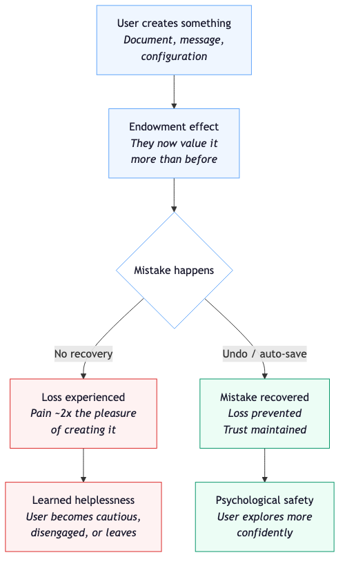

*Loss aversion applied to interface design. Once a user creates something, the endowment effect means they value it disproportionately. If a mistake destroys it and there's no recovery path, the loss is felt at roughly twice the intensity of the original pleasure of creating it. Repeated unrecoverable losses lead to learned helplessness — the user stops trying. Recovery paths (undo, auto-save, soft delete) prevent the loss and build psychological safety — the user explores more confidently because they know the ground is soft.*

## Psychological Safety

In 1999, Amy Edmondson published a study of 51 work teams in a manufacturing company that introduced a concept she called psychological safety — a shared belief that the team is safe for interpersonal risk-taking. [3]

Her finding was counterintuitive. The best-performing teams didn't make fewer mistakes. They reported *more* mistakes. Not because they were worse at their jobs, but because they felt safe admitting when something went wrong. That safety enabled faster correction and deeper learning. Teams without psychological safety hid their errors, which meant the errors persisted and compounded.

Edmondson's earlier work with hospital teams showed the same pattern: the highest-performing units had the highest reported error rates. The nurses and doctors weren't making more mistakes — they were surfacing them, discussing them, and fixing them, because the culture allowed it. [4]

Products create the same dynamic. A product with no undo, no recovery path, and punitive error handling teaches users to be careful in the wrong way — careful not to explore, not to try things, not to make the small mistakes that lead to learning. A product with reliable undo, auto-save, and graceful recovery teaches the opposite: try things. If something goes wrong, we've got you.

The parallel is direct. A team where mistakes are punished produces people who hide their errors. A product where mistakes are permanent produces users who avoid taking risks. Both are less effective than the alternative — not because they have more errors, but because they have less learning.

## The Pencil and the Pen

A pencil usually comes with an eraser on the end. It's built into the tool — not as an afterthought but as part of the design. The people who put erasers on pencils understood something fundamental: writing is a process of trying, adjusting, and revising. The tool should support that process, not punish it.

A pen, traditionally, doesn't have an eraser. Writing with a pen is a commitment — every mark is permanent. That's fine for signing a contract, but it changes how you write everything else. You slow down. You plan more. You're less willing to try something that might not work, because the cost of failure is visible and indelible.

And here's the thing: even pen manufacturers eventually came around. Pilot's Frixion range uses thermosensitive ink that can be erased with friction — a pen with a built-in eraser, because the demand for recovery was so universal that an entire ink technology was invented to meet it. The pen industry literally reinvented ink so that pens could have what pencils always had. That's how fundamental the need for undo is. Even the tool that was defined by permanence found a way to offer recovery.

Most products are still traditional pens. Deletion is permanent. Submission is final. Navigation is a one-way door. The user is expected to get it right the first time, and when they don't, the product shrugs.

The best products are pencils — or at least Frixion pens. They build recovery into the tool, not because they expect failure, but because they understand that the freedom to fail safely is what makes confident, productive use possible.

## Four Recovery Patterns

There are four broad approaches to designing for mistakes, and they form a progression from minimal to generous.

**Confirmation dialogs.** "Are you sure you want to delete this?" The most common and the laziest. Confirmation dialogs interrupt flow, train users to click "Yes" without reading (because they appear so often), and place the burden of prevention on the user rather than the system. They're better than nothing, but only just. [5]

**Undo.** Gmail's approach. Let the action happen, then offer a window to reverse it. Undo is less disruptive than confirmation because it doesn't interrupt the flow — the user acts, sees the result, and decides whether to reverse. It places the burden on the system (which has to support reversal) rather than the user (who has to predict the future). Five seconds of undo is worth more than any number of confirmation dialogs.

**Auto-save.** Google Docs' approach. Don't ask the user to remember to save. Save continuously, automatically, invisibly. The anxiety of "did I save?" evaporates entirely. The user can close the tab, lose their connection, or shut the laptop, and their work is safe. Auto-save doesn't prevent mistakes — it prevents the catastrophic version of the most common mistake (forgetting to save).

**Soft delete.** The recycle bin. Deletion isn't permanent — it's staged. The item moves to a holding area where it can be recovered. Permanent deletion requires a second, deliberate action. This inverts the default: recovery is easy, destruction is hard. The user has to actively choose permanence rather than accidentally stumbling into it.

> **Figure 10.2 — Recovery Patterns: From Lazy to Generous**

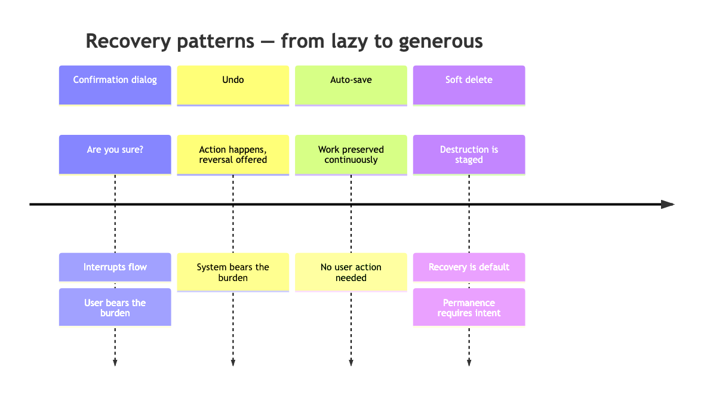

*Four recovery patterns, from lazy to generous. Confirmation dialogs interrupt the user and ask them to predict the future. Undo lets the action happen and offers reversal — less disruptive, more respectful. Auto-save removes the most common catastrophic failure (forgetting to save) entirely. Soft delete inverts the default: recovery is easy, permanent destruction requires deliberate intent. Each step rightward shifts the burden from the user to the system.*

## Learned Helplessness

Martin Seligman — the same researcher whose positive psychology work appears in Chapter 13 — began his career studying the opposite of flourishing. In 1967, he identified a phenomenon called learned helplessness: when organisms repeatedly experience uncontrollable negative outcomes, they eventually stop trying to avoid them — even when avoidance becomes possible. [6]

The principle translates directly to interfaces. When users repeatedly lose work, encounter unrecoverable errors, or hit dead ends with no guidance, they learn a specific lesson: trying doesn't help. The system will punish you regardless. So you stop trying.

This manifests as caution that looks like disengagement. The user doesn't explore features because they've learned that unexpected things happen and can't be undone. They save obsessively — Ctrl+S every thirty seconds — because they've learned that the system won't do it for them. They avoid destructive actions entirely, working around deletion rather than using it, because they've learned that deletion is permanent and recovery is impossible.

These aren't rational responses to current risks. They're conditioned responses to past experiences. A user who was burned by a product that lost their work carries that anxiety into every subsequent product — even ones that auto-save perfectly. The damage from poor recovery design outlasts the product that caused it.

The antidote is consistent, reliable recovery. If every mistake is recoverable, users learn the opposite lesson: this system has my back. They explore more. They try things. They make productive mistakes — the kind that lead to discovering features, understanding capabilities, and building confidence.

## Graceful Degradation

There's one more pattern that doesn't fit neatly into the four above, but matters enormously: what happens when the system itself fails partway through.

A network connection drops while you're writing an email. A server error occurs during a file upload. A payment processor times out mid-transaction. These aren't user mistakes — they're system failures. But the user experiences them as losses, because the work they were doing is now in an uncertain state.

Graceful degradation means preserving what you can. If the network drops, the draft should survive locally. If the upload fails, the file should be queued for retry, not lost. If the payment times out, the system should check whether the charge went through before showing an error — not leave the user wondering whether they've been charged twice.

The Mauritius booking from the last chapter is a graceful degradation failure. The system didn't fail — it just didn't communicate. But a system that fails *and* communicates ("We lost the connection, but your draft is saved — you can try again when you're back online") is doing something generous: it's separating the system failure from the user's work. The thing broke, but your stuff is safe.

## Try This

Think about the last time you lost work in a product. Not a hypothetical — a real memory. Something you wrote, configured, or created that disappeared because of a crash, a timeout, a misclick, or a missing save.

How did it feel? And — more importantly — how did it change the way you used that product afterwards? Did you start saving more often? Did you avoid certain actions? Did you copy text to your clipboard before submitting it, just in case?

Those defensive behaviours are learned helplessness in miniature. They're the scar tissue from a product that didn't have an eraser.

## Soft Ground

My email to the wrong client would have been a bad afternoon. Gmail turned it into a non-event. Five seconds of undo, a small yellow bar, and the mistake evaporated. I didn't have to be more careful next time. I didn't have to develop a defensive habit. I just had to click "Undo" within five seconds, and the product handled the rest.

That's what good recovery design does. It makes the ground soft. Not so soft that actions have no consequences — you can't undo a payment, and you shouldn't be able to. But soft enough that the normal, human, everyday mistakes that everyone makes don't leave permanent marks.

Even pen manufacturers figured this out. If the demand for recovery is strong enough to reinvent ink, it's strong enough to justify an undo button.

The next chapter is about the users who never report their mistakes — who never file a bug, never call support, never leave feedback — because the product wasn't built with their reality in mind.

## References

[1] Gmail Undo Send: launched in Google Labs March 2009, graduated to official feature June 2015, window extended from 5 to 30 seconds. [Google Blog — New in Labs: Undo Send (2009)](https://gmail.googleblog.com/2009/03/new-in-labs-undo-send.html). [The Next Web — Gmail's Undo Send Finally Graduates (2015)](https://thenextweb.com/google/2015/06/23/gmails-undo-send-feature-finally-graduates-out-of-labs-after-six-years/).

[2] Kahneman, D. & Tversky, A. "Prospect Theory: An Analysis of Decision under Risk." *Econometrica*, 47(2), 263–291, 1979. [Wikipedia — Prospect Theory](https://en.wikipedia.org/wiki/Prospect_theory). [The Decision Lab — Loss Aversion](https://thedecisionlab.com/biases/loss-aversion).

[3] Edmondson, A. C. "Psychological Safety and Learning Behavior in Work Teams." *Administrative Science Quarterly*, 44(2), 350–383, 1999. [SAGE Journals](https://journals.sagepub.com/doi/10.2307/2666999).

[4] Edmondson's hospital study — highest-performing units had highest reported error rates. [MIT — Full Paper PDF](https://web.mit.edu/curhan/www/docs/Articles/15341_Readings/Group_Performance/Edmondson%20Psychological%20safety.pdf).

[5] Confirmation dialogs train users to click "Yes" without reading — effectiveness degrades with frequency.

[6] Seligman, M. E. P. Learned helplessness research (1967). Overview at [Leda — Psychological Safety: The Complete Guide](https://getleda.com/psychological-safety).

---

# The Invisible User

In December 2014, Eric Meyer — a web standards advocate, CSS expert, and one of the people who helped shape the early web — opened Facebook and was shown his Year in Review. A generated card appeared with his daughter Rebecca's photo in the centre, surrounded by dancing cartoon people and confetti. The caption read: "It's been a great year! See your year in review."

Rebecca had died of aggressive brain cancer that June. She was six years old. She died on her sixth birthday, less than ten months after diagnosis. [1]

Meyer wrote a blog post about it. He called it "Inadvertent Algorithmic Cruelty." The phrase has stayed with me since I first read it, because it captures something precise. The cruelty wasn't intentional. Nobody at Facebook decided to torment a grieving father. The algorithm did what it was designed to do: find the most-engaged-with photo of the year and present it in a celebratory frame. For the overwhelming majority of users, this worked exactly as intended — "reminding people of the awesomeness of their years, showing them selfies at a party or whale spouts from sailing boats," as Meyer put it. [2]

For those who had experienced death, divorce, illness, job loss, or any other crisis that year, the algorithm was devastating. Not because it was broken. Because it was working perfectly, and nobody had asked: what if this year wasn't great?

Facebook had an Empathy Team. They still shipped it.

## Edge Cases and Stress Cases

The traditional term in software development for the scenario Eric Meyer experienced is "edge case" — an unusual situation at the extreme end of expected use. Edge cases are, by definition, rare. They affect a small number of users. And the implication of the label is that they can be safely deprioritised, handled later, or accepted as known limitations.

Sara Wachter-Boettcher and Eric Meyer — the same Eric Meyer — published a book in 2016 called *Design for Real Life* that proposed a different frame. They argued that these situations should be called **stress cases**, not edge cases. [3]

The difference in language is the difference in attitude. An edge case says: *this scenario is unlikely and marginal.* A stress case says: *this scenario tests the strength of our design.* The first invites deprioritisation. The second demands resilience.

Their philosophy: "Start with the most vulnerable, distracted, and stressed-out users and work outward, because when we make things for people at their worst, they'll work that much better when people are at their best." [4]

This is the opposite of how most products are designed. Most products start with the happy path — the user who is calm, competent, connected, and having a normal day — and then handle exceptions as afterthoughts. The stress case approach starts with the person who is grieving, anxious, confused, or in crisis, and designs for them first. If the product works for the person having the worst day of their life, it will work beautifully for everyone else.

> **Figure 11.1 — Edge Case vs. Stress Case Thinking**

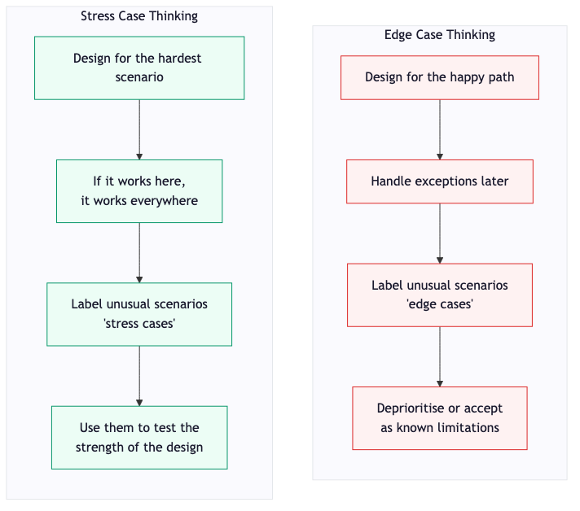

*Two approaches to unusual scenarios. Edge case thinking starts with the happy path and treats difficult situations as marginal — unlikely, deprioritised, accepted. Stress case thinking starts with the most difficult scenario and uses it to test the design's strength — if the product holds up under stress, it works for everyone. The difference isn't technical. It's a question of who you choose to think about first.*

## The Pregnancy App

Some of the most distressing examples of happy-path design failures come from pregnancy-tracking apps.

About 20% of known pregnancies end in miscarriage. That's not an edge case — it's one in five. And yet, many pregnancy apps have historically had no way to record a loss. The app continues sending cheerful weekly updates about the baby's development. "Your baby is now the size of a lime!" "Week 14 — your baby can squint and frown!" The notifications arrive, week after week, for a pregnancy that no longer exists. [5]

Some apps did eventually add an option to report a loss. But the implementation sometimes made it worse. One app required users to sign up for a "personalised baby development newsletter" before they could access the option to report that the baby had died. Another, when a loss was reported, simply erased the pregnancy from the user's profile entirely — as if it had never happened — which was devastating for users who wanted to keep a record of those weeks. [6]

These aren't obscure apps with tiny teams. These are products used by millions of people, built by companies with substantial design and engineering resources. The failure isn't technical — there's nothing technically difficult about adding a "record a loss" option. The failure is imaginative. Nobody on the team asked: what's the worst thing that could be happening in someone's life when they open this app?

Or, worse: someone did ask, and the answer was deprioritised as an edge case.

## The Form That Excludes

My brother-in-law's story from Chapter 6 — the password field that refused to explain its own rules — is one version of the invisible user. Here's another that I think about often.

Government benefit applications that require a home address. You can't complete the form without one. The field is mandatory. The validation won't let you proceed with an empty address field.

An estimated 382,000 people in England alone are experiencing homelessness. Not the whole of the UK — just England. That's roughly 0.65% of the population. [7] It's not the majority of benefit applicants, but it's not a small number either. It's hundreds of thousands of real people. And among them are some of the people who most need the benefits the form is gatekeeping. The system built to help them has a mandatory field that excludes them.

This isn't a technology problem. The database can store a null address. The form can accept an alternative input — a shelter address, a support worker's contact, a PO box. The fix is trivial. But the fix requires someone on the team to have thought: who is the most vulnerable person likely to use this form, and does it work for them?

## The Science of Invisibility

Every chapter in this book has drawn on psychological research that applies to all users. This chapter draws on the same research but applies it to users under maximum stress — and in doing so, reveals how much harder the same principles hit when the person is already in pain.

**Loss aversion** from Chapter 10: when someone has already experienced a real-world loss — a death, a diagnosis, a relationship ending — a product that compounds it with a digital loss (insensitive messaging, deleted records, celebratory assumptions) isn't just a bad experience. It's a wound on top of a wound. The 2x pain multiplier from Kahneman's research applies to someone who is already in pain.

**Processing fluency** from Chapter 6: under stress, cognitive load is already maxed. Dense copy, ambiguous options, and multi-step flows that are merely annoying to a calm user become impassable barriers to a stressed one. The `.aspx` password form was frustrating for me. For my brother-in-law, it would have been a wall.

**Psychological safety** from Chapter 10: Edmondson's finding was that the best teams report more errors because they feel safe doing so. The invisible user doesn't report bugs. They don't file support tickets. They don't leave reviews. They silently leave — or worse, they silently endure. The product never learns what went wrong, because the people who experienced the worst of it don't have the energy or the confidence to tell anyone.

> **Figure 11.2 — The Silence of the Invisible User**

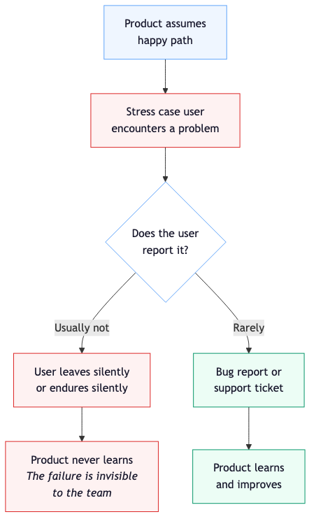

*The invisible user cycle. Products designed for the happy path create failures that disproportionately affect the most vulnerable users — who are the least likely to report them. The product never learns, because the feedback loop is broken at the point of most pain. The only way to break this cycle is to design for the stress case before shipping, not to wait for the bug report that will never come.*

## The Question to Ask

Meyer and Wachter-Boettcher's framework is practical. It starts with a single question that can be applied to any feature, any screen, any piece of copy:

**What's the worst thing that could be happening in someone's life when they encounter this?**

A "Year in Review" feature: the worst thing is that the year involved a death. A pregnancy app: the worst thing is that the pregnancy ended. A congratulatory notification: the worst thing is that the achievement was involuntary or associated with suffering. A benefits form: the worst thing is that the applicant has nowhere to live.

Asking this question doesn't mean designing for despair. It means designing with awareness. It means building the opt-out before the feature. It means testing the screen with a stressed persona, not just a happy one. It means checking whether the form works for the person who needs it most, not just the person the team imagined.

Libby Bawcombe at NPR compiled a list of 50 stress cases for news product design. They included: "A user who is reading about a mass shooting that happened in their community." "A user who sees a photo of their abuser in a news story." "A user who is news-literate but seeing coverage of their own trauma." [8]

Fifty scenarios. None of them are edge cases. All of them are things that happen to real people, regularly, while they're using a product that hasn't thought about them.

## Allow Silence

Not every return needs a cheerful greeting. Chapter 3 argued for recognition — acknowledging that a user has come back, remembering their context, showing them what changed. That's right for most situations. But there are moments where the kindest thing a product can do is say nothing and let the user lead.

A pregnancy app that has been told about a loss should not greet the user with "Welcome back! Here's what's new with your baby." It should greet them with silence — or with a gentle, neutral acknowledgement that doesn't assume they're in a celebratory mood.

A fitness app opened for the first time in two months should not lead with "Where have you been?!" It has no idea where they've been. They might have been ill. They might have been caring for someone. They might have been grieving. The absence might be the most loaded part of their story, and the product should approach it gently, not with manufactured enthusiasm.

This is the hardest version of the recognition principle from Chapter 3. Recognition means knowing when to speak and when to be quiet. The pub staff who know when to chat and when to just pour the drink without saying much — that's the same skill, applied to the same moment.

## Try This

Pick a feature you've built or are building. Now write down three stress cases for it — three scenarios where the user is under genuine pressure, distress, or constraint when they encounter it.

Don't reach for the dramatic. The stress case doesn't have to be a bereavement or a crisis. It could be: a user who is filling in this form on a bus, with one hand, on a cracked screen. A user who doesn't speak the language the interface is written in fluently. A user who has been staring at screens for eleven hours and can barely focus.

Now look at the feature through those eyes. Does it still work? Is the text still readable? Is the flow still completable? Is the tone still appropriate?

If the answer is no, you've found something that matters. Not an edge case — a stress case. And fixing it will make the feature better for everyone.

## The Neighbour

There's a version of kindness that doesn't ask "how are you?" — because sometimes that question is a burden. The honest answer is too heavy for the conversation, and the dishonest answer costs energy the person doesn't have.

The neighbour who comes round and says "I brought you this" — a meal, a bag of shopping, a plant for the garden — is practising a different kind of care. They're not asking the person to perform being okay. They're offering something useful without requiring a response. The gesture is the communication. No cheerful greeting. No expectation of reciprocity. Just: here. This is for you.

Products can do this. A pregnancy app that, after a reported loss, quietly removes the weekly update notifications without fanfare and replaces them with a single link to support resources — that's "I brought you this." A benefits form that offers an alternative to a home address — a shelter, a support worker's address, a PO box — without requiring the applicant to explain why they don't have one. That's "I brought you this."

Eric Meyer's daughter Rebecca would have turned twelve in 2020. The algorithm that showed her photo surrounded by confetti didn't know that. It couldn't know that. But someone could have asked — before the feature shipped, before the code was written, before the celebratory frame was designed — what if this year wasn't great?

That question. Before the code. Before the design. Before the celebration.

That's where the invisible user becomes visible.

## References

[1] Eric Meyer — "Inadvertent Algorithmic Cruelty." Blog post, 24 December 2014. [meyerweb.com](https://meyerweb.com/eric/thoughts/2014/12/24/inadvertent-algorithmic-cruelty/).

[2] Meyer's description of the Year in Review: "reminding people of the awesomeness of their years." Facebook product manager Jonathan Gheller apologised. [Slate — Facebook Year in Review: My Tragic Year](https://slate.com/technology/2014/12/facebook-year-in-review-my-tragic-year-was-the-wrong-fodder-for-facebook-s-latest-app.html).

[3] Wachter-Boettcher, S. & Meyer, E. *Design for Real Life*. A Book Apart, 2016. [A List Apart — Design for Real Life Interview](https://alistapart.com/article/design-for-real-life-interview-with-sara-wachter-boettcher/).

[4] "Start with the most vulnerable, distracted, and stressed-out users and work outward." [A List Apart — Design for Real Life Excerpt](https://alistapart.com/article/design-for-real-life-excerpt/).

[5] Approximately 20% of known pregnancies end in miscarriage. Pregnancy apps continuing to send development updates after a loss. [Clare Rose Foster — Why Do Pregnancy Apps Regularly Fail to Offer Support for Baby Loss?](https://www.clarerosefoster.co.uk/2022/09/apps-for-pregnancy-after-loss/).

[6] One app required newsletter sign-up to report a loss; another erased the pregnancy entirely from the user's profile. [Clare Rose Foster](https://www.clarerosefoster.co.uk/2022/09/apps-for-pregnancy-after-loss/). [MobiHealthNews — Glow's Pregnancy App Now Helps Women Who Have Had Miscarriages](https://www.mobihealthnews.com/40557/glows-pregnancy-app-now-helps-women-who-have-had-miscarriages).

[7] Estimated 382,000 people experiencing homelessness in England. Homelessness statistics vary by source and methodology; this figure represents people in temporary accommodation, rough sleeping, and other forms of homelessness.

[8] Bawcombe, L. "Designing News Products With Empathy: 50 Stress Cases to Consider." NPR Design, 2018. [NPR Design](https://npr.design/designing-news-products-with-empathy-50-stress-cases-to-consider-61f068a939eb).

---

# Systematizing Tiny Kindnesses

Everything in this book so far has been about individual moments. A loading state here. An error message there. A welcome-back screen, a progress indicator, a recovery path. Each one is a small mercy — a place where someone paid attention and the product was better for it.

But here's the problem: individual attention doesn't scale. One developer who cares deeply about loading states can improve one product. One content designer who writes humane error messages can fix one set of forms. One accessibility specialist who checks every component for `prefers-reduced-motion` support can audit one library. They do good work. Important work. And the moment they leave the team, move to another project, or go on holiday, the standard starts to drift.

I've seen this happen. A team ships a product with thoughtful loading states, careful microcopy, and accessible motion. Six months later, a new feature goes out with a generic spinner, an "Error: something went wrong" message, and no reduced-motion fallback. Nobody did anything wrong. Nobody decided to stop caring. The original developer just wasn't in the code review for that PR, and nobody else knew to check.

The question this chapter asks is: how do you stop the kindness depending on the individual?

## The Prep List

There's a concept in professional kitchens called the prep list. It's the document — written, posted on the wall, checked off during the shift — that records what needs to be done before service. Stocks made. Vegetables cut. Sauces reduced. Stations set.

In a kitchen where the head chef keeps everything in their head, the food is as good as the chef's memory. When the chef is off sick, the kitchen falls apart. Nobody knows what was prepped yesterday. Nobody knows what needs doing today. The knowledge lives in one person, and when that person isn't there, the knowledge isn't either.

In a kitchen with a prep list, the knowledge survives the individual. A new cook can walk in, read the list, and know exactly what's expected. The standard doesn't depend on who's working. It depends on the system.

Design systems are the prep list.

## What Design Systems Actually Do

A design system is usually described as a collection of reusable components, design tokens, documentation, and governance guidelines. Buttons, form fields, navigation patterns, colour scales, spacing units — packaged up so teams can install them and build consistently. [1]

That's accurate, but it misses the point. The real product of a design system isn't components. It's encoded decisions. Every token, every component default, every pattern carries a decision that was made once, carefully, and doesn't have to be remade by every developer on every feature.

A spacing token that enforces 8px increments is a decision about visual rhythm. A button component that includes focus styles by default is a decision about keyboard accessibility. A form component that surfaces inline validation with plain-language messages is a decision about how errors should feel. Each one is a small mercy baked into the infrastructure, available to every team that uses the system, regardless of whether anyone on that team personally remembers to check.

This is what it means to systematise kindness. The care isn't in the exception — the one developer who remembers. It's in the default — the system that provides it automatically.

## Accessibility as Default

WebAIM's 2026 analysis of the top one million websites found that 95.9% had at least one detectable WCAG failure — up from 94.8% the year before. The number went in the wrong direction. [2]

Ninety-five point nine percent. The web, in 2026, is almost universally inaccessible. And it's getting worse, not better.

This number doesn't shift because individual developers don't care. Many do. It shifts because accessibility, when treated as an individual responsibility, is the first thing lost to deadline pressure, scope creep, and the simple fact that most developers don't encounter the barriers their users do. You don't notice your buttons lack focus styles if you never use a keyboard to navigate. You don't notice your motion makes people dizzy if your vestibular system works fine.

Accessible design systems change this equation. When accessibility is encoded in the tokens, component patterns, and contribution guardrails, it stops being something individual developers remember to add and becomes something the system provides. [3]

The GOV.UK Design System updated all 44 of its components for WCAG 2.2 compliance in 2024. Every component specifies ARIA attributes, keyboard interactions, and applicable success criteria. When a team builds a service using the GOV.UK Design System, they get accessibility for free — not because they're accessibility experts, but because the system is. [4]

The result: pages built with the GOV.UK Design System download about twice as fast as those built without it, because they use about half as much code. During the start of the pandemic, 52 government services were built within weeks using the design system — not months — because the foundational decisions had already been made. [5]

That's the power of encoding care into infrastructure. It doesn't just improve quality. It improves speed. It improves consistency. And it removes the dependency on any one person remembering to do the right thing.

> **Figure 12.1 — Individual Care vs. Systematic Care**

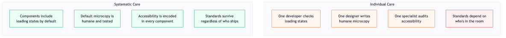

*The difference between individual care and systematic care. Individual care depends on who's in the room — it's as good as the team's memory and as fragile as their availability. Systematic care is encoded in the infrastructure — components, tokens, defaults, and guidelines that provide the right behaviour regardless of who's building with them. The first produces inconsistent quality. The second produces a floor that nobody falls below.*

## The Fogg Behavior Model (Again)

Chapter 8 introduced BJ Fogg's Behavior Model in the context of dark patterns — the same framework that builds healthy habits also builds exploitative engagement loops. This chapter uses it for its intended purpose: building a team culture where the right behaviour is the easy behaviour.

Fogg's model: behaviour happens when **Motivation**, **Ability**, and a **Prompt** converge simultaneously. If any element is missing, the behaviour doesn't occur. [6]

Applied to team practices:

**Motivation**: the team needs to understand *why* the small moments matter. This is where the science from the rest of the book comes in — the peak-end rule, the affect heuristic, the mere-exposure effect, processing fluency, loss aversion. These aren't abstract theories. They're the mechanism by which every microinteraction either builds or erodes trust. Showing the team user research clips, error analytics, and real examples (the password field that cost a charity a month of funding, the pregnancy app that couldn't record a loss) provides the emotional fuel.

**Ability**: make the right thing easy. A component library where every element is already accessible, where loading states are built in, where error messages follow the plain-language standard from the style guide. If adding a loading state requires three minutes of work, it'll get done. If it requires an hour of custom development, it'll get cut when the deadline hits.

**Prompt**: reliable triggers at the moment of decision. A PR template that asks "Did you check the loading state? The error state? The empty state?" A linting rule that flags missing `aria-label` attributes. A design review checklist that includes "How does this feel when it goes wrong?" alongside "How does this look when it goes right?"

> **Figure 12.2 — The Fogg Model Applied to Team Culture**

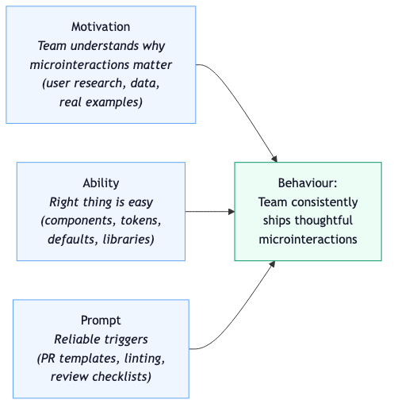

*BJ Fogg's Behavior Model applied to team culture. Motivation comes from understanding why the small moments matter (research, data, real stories). Ability comes from making the right thing easy (design system components with care built in). Prompts come from reliable triggers at the moment of decision (PR templates, linting rules, review checklists). When all three converge, the team consistently ships thoughtful microinteractions — not because of individual heroism, but because the system supports the behaviour.*

## Review Rituals

The design system provides the defaults. Review rituals provide the checkpoints.

Code review is the most obvious one, and the most underused for this purpose. Most code reviews check whether the code works, whether it's clean, and whether it follows architectural conventions. Very few ask: what does the loading state look like? What happens if this API call fails? What does the empty state say? Is there a success confirmation?

Adding these questions to the review process doesn't require a new tool or a new meeting. It requires a checklist — a literal list of questions that someone runs through before approving a PR. Does this feature handle the error state? Does it have a loading indicator? Does it work with `prefers-reduced-motion`? What does the microcopy say when things go wrong?

Design critique can serve the same function. Most design reviews ask "how does this look?" The stress case question from Chapter 11 — "what's the worst thing that could be happening in someone's life when they encounter this?" — belongs in every design review, right next to "does the visual hierarchy work?"

These rituals compound. One review catches one missing loading state. A hundred reviews, each catching one thing, produce a product where the small moments are consistently handled. The rituals don't replace the design system — they complement it. The system provides the materials. The reviews check that they're being used.

## The Aspiration and the System

There's a difference between a team that says "we care about accessibility" and one that ships a component library where every element is already accessible. The first is an aspiration. The second is a system. Aspirations are lovely. Systems ship.

The same applies to every principle in this book. A team can aspire to write humane error messages, but if the default error component ships with "Error: something went wrong" and nobody changes it, the aspiration is irrelevant. A team can aspire to respect motion preferences, but if the animation library doesn't check `prefers-reduced-motion`, the aspiration is invisible to the user who gets a migraine.

Systems encode values. Every default is a value statement. A component that ships with focus styles says "keyboard users matter here." A form that ships with inline validation and plain-language messages says "we expect mistakes and we'll help you recover." A motion token that respects `prefers-reduced-motion` says "your comfort is more important than our animation."

The system you build is the culture you ship. And the culture you ship is what the user feels.

## Try This

Look at the last five PRs your team merged. For each one, ask:

Was there a loading state? Was there an error state? Was there an empty state? Was there a success confirmation? Did anyone in the review ask about any of these?

If the answer to all five is yes, your system is working. If the answer to any of them is no, you've found a gap — not in any individual's care, but in the system's coverage. Fill the gap with a default, a checklist item, or a component. Make the next PR easier to get right.

## The Prep List

This book started with a film about paying attention. Chapter 1 argued that the craft of noticing — of treating ordinary moments as worth caring about — is what separates a product that works from one that feels good.

Twelve chapters later, the question is no longer whether to notice. It's how to make noticing survive the individual. How to build a kitchen where the prep list is on the wall, where the standards are in the system, where the care is in the default — so that every developer, every designer, every content writer who touches the product has the materials and the prompts to do it right, regardless of whether the person who originally cared is still in the room.

The soft-close drawers from Chapter 5 close gently every time, for every person, because the mechanism is in the hinge — not in the hand that pushes them shut. That's what a design system does. It puts the mechanism in the hinge.

The final chapter returns to where we started — to the film, the philosophy, and the question of what it means to live in the present tense.

## References

[1] Design systems: reusable components, design tokens, documentation, and governance. [IxDF — What Are Design Systems? (2026)](https://ixdf.org/literature/topics/design-systems).

[2] WebAIM 2026 Million analysis: 95.9% of top million websites had at least one detectable WCAG failure, up from 94.8% in 2025. [WebAIM — The WebAIM Million 2026](https://webaim.org/projects/million/).

[3] Accessible design systems transform accessibility from per-feature effort to organizational default. [TestParty — Accessibility as Design System Policy](https://testparty.ai/blog/accessibility-as-design-system-policy).

[4] GOV.UK Design System updated all 44 components for WCAG 2.2 in 2024. [GOV.UK Design System — Live Reassessment](https://www.gov.uk/service-standard-reports/gov-uk-design-system-live-reassessment).

[5] GOV.UK Design System: pages download ~2x faster, 52 services built in weeks during pandemic. [GDS Blog — The GOV.UK Design System Is Now Live](https://gds.blog.gov.uk/2022/03/31/the-gov-uk-design-system-is-now-live/).

[6] Fogg, B. J. Behavior Model: Motivation + Ability + Prompt. [behaviormodel.org](https://www.behaviormodel.org/). Over 1,900 academic publications reference the model.

---

# The Present-Tense Interface

I'm going to start this last chapter where the first one started — with Tim, and with the film my wife and I keep coming back to.

At the end of *About Time*, Tim stops travelling back in time. He stops fixing things. He stops reliving days to notice what he missed. He just lives each day once, as if he'd deliberately chosen to return to it. Not to correct it. Not to optimise it. Just to be in it — fully, attentively, with the ordinary things given the weight they deserve.

His daughter waves three times at the school gate, and he sees all three because he stayed. A nurse dances. Harry lands a bottle in a bin. Tim gets up early with the kids when he's exhausted, because he wants to. These are not extraordinary moments. They're the texture of a Tuesday. And the film's argument — the one that has stuck with me for years — is that the texture of a Tuesday is enough, if you pay attention to it.

> "And in the end I think I've learned the final lesson from my travels in time; and I've even gone one step further than my father did: The truth is I now don't travel back at all, not even for the day, I just try to live every day as if I've deliberately come back to this one day, to enjoy it, as if it was the full final day of my extraordinary, ordinary life." [1]

This book has been about the same idea, applied to a different medium. But it's also been about something larger than microinteractions and design patterns. It's been about being human. Being kind. Being understanding and generous. Creating experiences that you would want to have yourself.

## What We've Covered

Twelve chapters. Each one about a different facet of the same argument: the small moments are where the feeling lives, and the feeling is what people remember.

The peak-end rule says people judge experiences by their most intense moment and their last moment — not the average. The affect heuristic says a single emotional reaction colours everything that follows. The mere-exposure effect says familiarity builds preference without conscious effort. Processing fluency says the easier something is to understand, the more trustworthy it feels. Loss aversion says losing something hurts twice as much as gaining the same thing feels good. Self-Determination Theory says people need autonomy, competence, and relatedness to be genuinely motivated.

Each of these is a piece of the puzzle. Together, they explain why a loading spinner matters. Why an error message that says "INVALID INPUT" damages trust. Why a welcome-back screen that remembers your context builds loyalty. Why a soft-close drawer feels like care. Why a progress bar that shows 78% electric feels more motivating than a badge.

And they explain why the reverse is also true. Why a blank screen during a payment creates disproportionate anxiety. Why confirmshaming erodes long-term trust even when it boosts short-term clicks. Why a pregnancy app that can't record a loss is experienced not as a missing feature but as cruelty.

The science is consistent. The mechanisms are well-understood. The techniques are not difficult. And yet — 95.9% of the top million websites fail basic accessibility standards, and the number is rising. Ninety-seven percent of popular apps deploy at least one deceptive pattern.

The gap between what we know and what we ship is enormous. This book is an attempt to close it — or at least to make the gap visible, and to argue that closing it is worth the effort.

## The Present Tense

Martin Seligman — the psychologist who studied learned helplessness in Chapter 10 — spent the second half of his career studying the opposite question. Not what makes people give up, but what makes them flourish. In 1998, he used his presidential address to the American Psychological Association to redirect the field toward positive psychology — the study of what makes life worth living. [2]

His PERMA model identifies five elements of human flourishing: Positive emotions. Engagement. Relationships. Meaning. Accomplishment. What's striking about the model is that none of these are big events. They're textures. They're the daily quality of experience — the small satisfactions, the moments of absorption, the connections that make a day feel meaningful. [3]

A 2023 study on "Momentary PERMA" went further: wellbeing can be measured not at the level of life satisfaction but at the level of individual moments. Flourishing isn't a destination. It's a quality of attention — a way of being in the present that makes ordinary moments feel sufficient. [4]

This is what Tim learns. This is what Bryant's savouring research from Chapter 1 describes. And this is what good products do, when they're built with care.

A product that lives in the present tense meets you where you are. It doesn't guilt you about yesterday's missed streak. It doesn't pressure you about tomorrow's deadline. It shows you what's happening now, what you can do next, and how things are going — and it does all of this in a way that respects your time, your attention, and your autonomy.

Does your product bring some level of PERMA? Does it give the user a moment of positive emotion — however small? Does it support engagement rather than interrupt it? Does it feel like a relationship rather than a transaction? Does it help people do something that matters to them? Does it acknowledge what they've accomplished?

These aren't luxury questions. They're the baseline for a product that treats its users as people rather than sessions.

## Daily Companions

Most of the software people use is used daily. Email. Messaging. Task management. Calendars. Banking. News. Weather. These aren't occasional tools. They're daily companions — the first thing you see in the morning and the last thing you check at night.

Daily companions shape the texture of a day. A companion that greets you warmly, helps you recover from mistakes, celebrates small progress, waits patiently when things take a moment, and speaks to you in plain language when things go wrong — that companion makes the day lighter. Not dramatically. Not in any way that would show up on a mood tracker. But in the cumulative way that small mercies always work: by changing how a day *feels*, one moment at a time.

The dog walk from Chapter 1. The pub from Chapter 3. The soft-close drawers from Chapter 5. The eight words that would have calmed the Mauritius payment. The fourteen words that would have unlocked my brother-in-law's account. The five seconds of Gmail undo that turned a bad afternoon into a non-event.

These are all the same thing. They're moments where someone — or something — paid attention to the present moment and treated it with care.

*About Time* is, at its heart, about the enjoyment of moments. Not the big ones — the ordinary ones. The coffee order. The court corridor. The school-gate wave. Our job — as frontend engineers, designers, product owners, content writers, anyone who shapes what people see and touch and feel when they use digital products — is to make products where users have moments they can enjoy. Where the interaction is intuitive enough to disappear into the task. Where the feedback is clear enough to build confidence. Where the language is respectful enough to feel human.

## What I'm Asking

I'm not asking you to rebuild your product from scratch. I'm not asking you to add a month to every sprint for microinteraction polish. I'm not asking you to read every study cited in this book and present the findings to your team in a three-hour workshop.

I'm asking you to notice.

The next time you ship a feature, look at the loading state. Is it a blank screen or does it tell the user what's happening? The next time you write an error message, read it out loud. Does it sound like something you'd say to a person, or something you'd write in a server log? The next time you design a form, think about the person who's filling it in on their worst day. Does it still work? Is the tone still right?

These are small questions. They take seconds to ask and minutes to fix. And each one is an opportunity to make the product a little more like the pub that remembers your name and a little less like the form that says "INVALID INPUT IN FIELD 3."

## The Ordinary Opportunity

Most products already occupy a slot in someone's daily life. The question isn't whether they have access to the user's attention — they do, for a few minutes a day, hundreds of times a year. The question is what they do with it.

The About Time lens from Chapter 1: what if you designed every interaction as if you'd deliberately come back to it? As if this screen — this form, this loading state, this error message, this welcome-back moment — was the one you chose to return to, to get right, to make worth noticing?

The felt-tip marker study from Chapter 7: the best motivation isn't added from outside. It's the motivation that's already there, made visible. The best microinteractions don't add delight to a product. They reveal the care that was there all along.

The prep list from Chapter 12: the care shouldn't depend on who's in the room. It should be in the system — in the components, the tokens, the defaults, the review rituals. The mechanism in the hinge, not the hand that pushes the drawer.

## Small Mercies

I started this book with a film about a man who could travel back in time and chose to stop. Who decided that the present moment — the ordinary, unremarkable, extraordinary present moment — was enough.

I've argued, across thirteen chapters, that products can make the same choice. That the loading state is a present moment. That the error message is a present moment. That the welcome-back screen, the progress bar, the form field, the animation, the empty state — each one is a present moment in someone's day, and each one can be designed as if someone chose to come back to it.

The science says these moments matter — that they're the peaks and ends and emotional temperature by which the entire experience is judged. The data says they move numbers — retention, satisfaction, trust, revenue. The ethics says they carry responsibility — because the same craft that makes a product feel warm can make it manipulative.

But underneath all the science and data and ethics, the argument is simpler than that. It's about being human. Being kind. Being understanding. Being generous. Building things that you would want to use yourself, in a way that treats the person on the other side of the screen as someone worth caring about.

It's the dog walk nod. The drink that's started before you've sat down. The drawer that closes gently. The eight words during a payment. The undo button that gives you five seconds of grace. The form that explains what it wants. The product that remembers you were working on Chapter 3.

Small mercies. Tiny, almost-invisible moments of recognition, care, and attention that change how a day feels.

We live in a world that is increasingly digital, increasingly isolated, and increasingly automated. The interfaces we build are, for many people, the most frequent point of contact they have with the organisations behind them. In some cases, they're the most frequent interaction in someone's day. We are the custodians of that medium. And it is up to us — every one of us who writes a line of code, designs a screen, or chooses the words that appear on it — to make sure we build in the humanity.

That's all this book is about. And if you've read this far, you already know how to do it. You just have to decide that the present moment — this one, this screen, this interaction — is worth coming back to.

> "I just try to live every day as if I've deliberately come back to this one day, to enjoy it, as if it was the full final day of my extraordinary, ordinary life."

Build it like you chose to return to it.

## References

[1] Tim (Domhnall Gleeson). *About Time*. Written and directed by Richard Curtis, Universal Pictures, 2013.

[2] Seligman, M. E. P. 1998 APA presidential address — redirecting psychology toward the study of what makes life worth living. [Positive Psychology — Martin Seligman](https://www.pursuit-of-happiness.org/history-of-happiness/martin-seligman-psychology/).

[3] Seligman, M. E. P. *Flourish*. Simon & Schuster, 2011. PERMA model: Positive emotions, Engagement, Relationships, Meaning, Accomplishment. [Penn Positive Psychology Center](https://ppc.sas.upenn.edu/learn-more/perma-theory-well-being-and-perma-workshops).

[4] Momentary PERMA: wellbeing measured at the level of individual moments. [PMC — Momentary PERMA (2023)](https://pmc.ncbi.nlm.nih.gov/articles/PMC10730635/).

---

